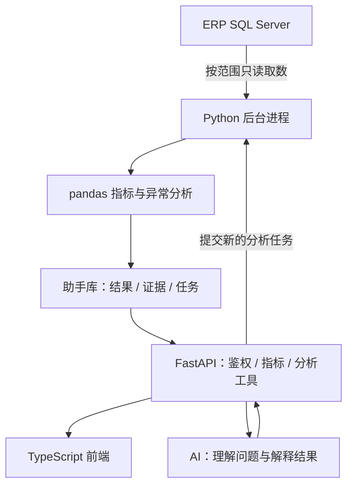

**ERP AI Assistant**

面向 B2B 交易平台的独立 AI 经营分析助手。平台连接入驻供应商与采购企业，本项目读取现有 ERP 的 SQL Server 数据，使用 pandas 计算经营指标，通过 FastAPI 向 TypeScript 前端提供看板、重点事项和 AI 问数能力。

**项目状态**

当前处于方案与数据口径设计阶段，仓库包含项目介绍、开发约定和规划文档。尚无可运行的前后端业务代码、依赖清单、数据库连接配置或自动化测试套件。

第一版面向平台内部管理者和运营人员。当前计算框架确定为 pandas，SQL Server 版本、真实表结构、数据规模和部署环境待确认。

**计划提供的功能**

| 功能 | 说明 |
|---|---|
| 经营看板 | 成交额、订单数、采购企业数、客单价及时间趋势 |
| 采购企业分析 | 采购变化、复购间隔、需要跟进的企业 |
| 供应商分析 | 成交表现、采购企业覆盖、商品贡献 |
| 商品分析 | 商品与品类的增长、下滑和成交结构 |
| 今日 Top 5 | 聚合值得关注的经营事项，展示依据、建议和负责人 |
| AI 问数 | 围绕已定义指标提问，查看分析结果、图表与订单依据 |
| 运营待办 | 将经营事项转为任务，记录进展和业务反馈 |

每条分析结论都应有明确的指标口径、统计时间和数据来源。支付、退款、履约等分析以 ERP 实际提供的数据为准。

**技术选型**

| 层次 | 选型 | 状态 |
|---|---|---|
| ERP 数据源 | SQL Server | 已确定 |
| 后端 | Python + FastAPI | 已确定 |
| 数据计算 | pandas | 已确定 |
| 前端语言 | TypeScript | 已确定 |
| 前端形态与框架 | Web／桌面、React／Vue | 待确定，当前建议先 Web |
| 数据访问 | SQLAlchemy + pyodbc + Microsoft ODBC 驱动 | 实施建议，需核对环境兼容性 |
| 结果存储 | 独立助手数据库，优先评估 SQL Server | 实施建议 |
| 后台分析 | 独立 Python 进程，先采用低并发任务 | 实施建议 |
| AI 模型 | 模型 API + 受控分析工具 + 输出校验 | 供应商及部署方式待评测 |
| 自动化测试 | pytest；前端工具随框架确定 | 计划引入，尚未配置 |

依赖版本在项目初始化时核对并锁定。当前实施采用 pandas，分布式计算和专用分析引擎作为未来扩展参考。

**工作方式**



SQL 查询先限制日期、字段和授权范围，pandas 执行可复算的业务计算。常用结果持久化并按计划更新，耗时分析由独立后台进程处理。AI 通过已定义工具获取指标与必要证据，数值计算和数据权限由程序控制。

重点统一主订单与供应商子订单的粒度、支付与退款口径、企业去重规则及金额精度，避免多表关联重复累计成交额。平台 GMV 与平台佣金／服务收入分别定义。

**文档导航**

- [AGENT.md](AGENT.md)：项目背景、技术决策、开发约定、测试方法和交付检查。
- [项目方案](docs/erp-ai-assistant-plan.md)：功能范围、数据接入、指标口径、接口与实施安排；第 15 节为当前 pandas 方案，第 14 节仅为未来扩展参考。

当前目录：

```text
erp-ai-assistant/
  README.md
  AGENT.md
  docs/
    erp-ai-assistant-plan.md
```

`backend/`、`frontend/` 和对应测试目录为后续规划，尚未创建。

**测试与验证**

当前可在仓库根目录检查文档修改的空白错误：

```powershell
git diff --check
git diff --cached --check
```

提交前还应检查本地文档链接、Markdown 代码块、技术选型一致性及提交内容。上述命令仅检查 Git 差异中的空白问题，不代表业务测试已通过。

业务代码落地后，按 [AGENT.md](AGENT.md) 中的测试约定验证 pandas 指标、SQL Server 接入、FastAPI 权限、任务重试和 AI 问数。当前尚无可执行的启动命令和 pytest 测试入口，初始化代码时需同步补充。

**下一步实施**

1. 梳理订单、明细、企业、商品以及可用的支付退款表结构与状态。
2. 确认销售指标定义和小规模、可人工复算的样例数据。
3. 建立 FastAPI 项目与 pandas 分析函数，先验证金额和数量对账。
4. 接入前端看板，再逐步完成 AI 问数、今日 Top 5 和运营待办。
