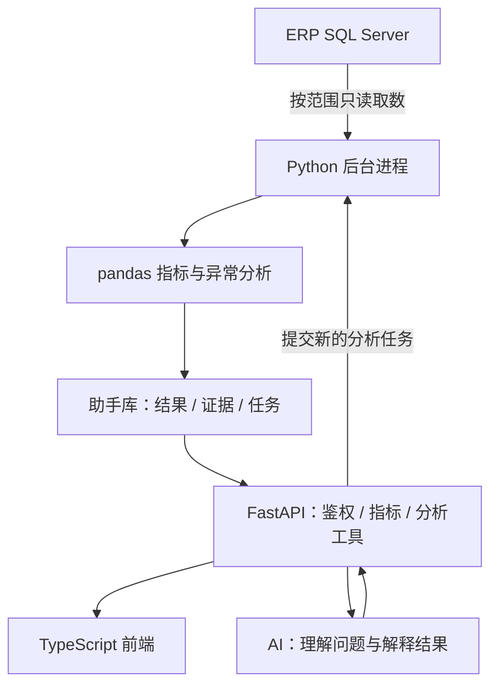

**ERP AI Assistant**

面向 B2B 交易平台的独立 AI 经营分析助手。平台连接入驻供应商与采购企业，本项目读取现有 ERP 的 SQL Server 数据，使用 pandas 计算经营指标，通过 FastAPI 向 TypeScript 前端提供看板、重点事项和 AI 问数能力。

**项目状态**

已完成销售订单分析后端及 React + TypeScript 经营看板：连接本地 QY 备份还原库，只读取数，使用 pandas 对账及计算，通过 FastAPI 查询结果与订单证据。数据所有者已确认备份覆盖整个平台全部商家。

当前页面包括经营概览、订单明细、业务口径。可切换**有效销售（暂定）**和**全部原始订单**，查看订单金额、订单数、采购企业数、每日趋势、客户／商品排行、状态分布及商品行证据。默认将订单完成、已出库纳入有效销售，货币暂按 CNY，时区暂按 Asia/Shanghai；不是支付成交额。

已有锁定依赖、后端测试及浏览器端到端测试。全部不确定业务细节集中维护在 [业务假设台账](docs/business-assumptions.md)，规则配置在 `backend/config/business-rules.json`，每份新快照保存规则版本与内容指纹。当前结果保存为 `.local/` 下的开发快照；助手 SQL Server 库、增量同步、任务调度、AI 问数、Top 5 和运营待办尚未实现。

**计划提供的功能**

| 功能 | 说明 |
|---|---|
| 经营看板 | 成交额、订单数、采购企业数、客单价及时间趋势 |
| 采购企业分析 | 采购变化、复购间隔、需要跟进的企业 |
| 供应商分析 | 成交表现、采购企业覆盖、商品贡献 |
| 商品分析 | 商品与品类的增长、下滑和成交结构 |
| 今日 Top 5 | 聚合值得关注的经营事项，展示依据、建议和负责人 |
| AI 问数 | 围绕已定义指标提问，查看分析结果、图表与订单依据 |
| 运营待办 | 将经营事项转为任务，记录进展和业务反馈 |

每条分析结论都应有明确的指标口径、统计时间和数据来源。支付、退款、履约等分析以 ERP 实际提供的数据为准。

**技术选型**

| 层次 | 选型 | 状态 |
|---|---|---|
| ERP 数据源 | 本地 `.\ERPLOCAL / ERP_Local` | 已只读验证，源自 QY 备份 |
| 后端 | Python 3.11 + FastAPI | 已实现首批查询接口 |
| 数据计算 | pandas | 已实现订单指标及主明细对账 |
| 前端语言 | TypeScript | 已确定 |
| 前端形态与框架 | Web + React + TypeScript + Vite | 已实现三页看板；静态构建由本地 FastAPI 同源提供 |
| 数据访问 | SQLAlchemy + pyodbc + Microsoft ODBC Driver 18 | 已验证本地 Windows 身份认证 |
| 结果存储 | 本地不可覆盖 JSON 开发快照 | 助手 SQL Server 库仍属后续规划 |
| 后台分析 | 独立 Python CLI | 已实现按日期／企业范围分析，调度尚未实现 |
| AI 模型 | 模型 API + 受控分析工具 + 输出校验 | 供应商及部署方式待评测 |
| 飞书集成 | 官方 Python SDK `lark-oapi` | 已准备 SDK 依赖；每日推送与调度尚未实现 |
| 自动化测试 | pytest + Ruff；TypeScript + Playwright | 后端单元、API、集成及前端浏览器测试 |

依赖版本已固定在 `backend/pyproject.toml`、`backend/requirements.lock` 和 `frontend/package-lock.json`。前端使用与本机 Node 20.18 兼容的 Vite 6。当前实施采用 pandas，分布式计算和专用分析引擎作为未来扩展参考。

**目标架构**



SQL 查询先限制日期、字段和授权范围，pandas 执行可复算的业务计算。常用结果持久化并按计划更新，耗时分析由独立后台进程处理。AI 通过已定义工具获取指标与必要证据，数值计算和数据权限由程序控制。

重点统一主订单与供应商子订单的粒度、支付与退款口径、企业去重规则及金额精度，避免多表关联重复累计成交额。平台 GMV 与平台佣金／服务收入分别定义。

**文档导航**

- [AGENT.md](AGENT.md)：项目背景、技术决策、开发约定、测试方法和交付检查。
- [项目方案](docs/erp-ai-assistant-plan.md)：功能范围、数据接入、指标口径、接口与实施安排；第 15 节为当前 pandas 方案，第 14 节仅为未来扩展参考。
- [第一阶段实施安排](docs/implementation-phase-1.md)：本次交付范围及阶段性技术决策。
- [数据字典](docs/data-dictionary.md)：真实表与字段映射、质量核验和待确认事项。
- [指标定义](docs/metrics-v1.md)：13 项首批指标及订单金额与支付口径的区别。
- [验证记录](docs/phase-1-validation.md)：实际执行的测试与覆盖边界。
- [业务假设台账](docs/business-assumptions.md)：18 项待确认细节、当前默认值、影响与修改位置；后续统一在此维护。
- [看板与规则验证](docs/phase-2-validation.md)：本次新增功能、浏览器验证及实际数据结果。

当前目录：

```text
erp-ai-assistant/
  README.md
  AGENT.md
  backend/
    app/               # API、数据连接、pandas 分析、输入输出契约
    workers/           # 独立运行的分析命令
    tests/             # unit、api、integration
    pyproject.toml
    requirements.lock
    config/            # 可调整的业务规则
  frontend/
    src/               # React 页面、图表、API 与金额格式化
    tests/             # Playwright + 合成数据服务
    package-lock.json
  scripts/             # 元数据／质量检查、API 启动脚本
  docs/
  .local/              # 本地快照与报告，Git 忽略
  database_backups/    # 原始备份与本机说明，Git 忽略
```

源库、备份、真实分析快照、访问令牌、测试截图和依赖目录均不提交到 Git。

**启动经营看板**

本机后端环境、前端构建及经营快照已就绪。在项目根目录运行：

```powershell
.\.venv\Scripts\python.exe .\scripts\start_backend.py
```

打开 `http://127.0.0.1:8000/`，输入 `.local/api-token.txt` 中的令牌。服务只监听本机；令牌仅保存在当前标签页的 sessionStorage，退出时清除。按 Ctrl+C 停止服务。接口文档仍位于 `/docs`。

首次检出或更改前端代码后，从 `frontend/` 安装并构建：

```powershell
npm ci
npm run build
```

FastAPI 在启动时检测 `frontend/dist` 并同源提供页面，无需额外部署前端服务。Python 启动脚本自动加载本地快照并复用或首次创建开发令牌，不受 PowerShell 的 `.ps1` 执行策略影响。无需先激活虚拟环境；修改后端代码后，按 Ctrl+C 停止并重新运行。原有 `scripts/Start-LocalApi.ps1` 仍可使用。

前后端分别开发时，保持后端终端运行，另开一个 PowerShell 窗口，从项目根目录执行：

```powershell
Set-Location frontend
npm run dev
```

打开终端显示的地址（默认 `http://127.0.0.1:5173`），使用同一令牌登录。Vite 将 `/api` 代理至本机 8000 端口，两个服务都需要保持运行。若出现 `ECONNREFUSED 127.0.0.1:8000`，先检查后端终端是否显示 `Uvicorn running`，并访问 `http://127.0.0.1:8000/healthz` 确认后端可用。前端修改自动刷新；后端代码修改后需重启后端。

**运行首批分析**

在项目根目录创建环境并安装锁定依赖（已有 `.venv` 可直接使用）：

```powershell
uv venv --python 3.11 .venv
uv pip sync --python .venv/Scripts/python.exe backend/requirements.lock
```

本机需要正在运行的 `ERPLOCAL` SQL Server 实例及 Microsoft ODBC Driver 18。默认连接本地 `ERP_Local`，使用 Windows 身份验证；可通过环境变量 `ERP_SOURCE_ODBC` 配置授权只读连接。`.env.example` 仅为说明，不会自动加载。

```powershell
Set-Location backend
..\.venv\Scripts\python.exe -m workers.analyze_sales --start 2026-09-01 --end 2026-09-17 --source-as-of 2026-09-16T14:33:41+08:00 --all-buyers
```

日期范围含起点、不含终点，最多 366 天。必须明确选择 `--all-buyers` 或一个／多个 `--buyer-code`。默认读取 `backend/config/business-rules.json`，可用 `--rules` 指定另一配置。备份时间不是最大订单日期；更换数据源时同步传入正确的来源截至时刻。命令打印新快照路径；任何关键对账失败都会停止发布。可指定 `--output`，但不允许覆盖已存在的快照。

回到根目录启动本地查询 API，将路径换成刚生成的快照：

```powershell
Set-Location ..
.\.venv\Scripts\python.exe .\scripts\start_backend.py --report-path '.local/reports/你的快照文件.json'
```

当前默认优先使用 `.local/reports/platform-operating-20260916.json`，其中包含业务规则与显示名称；旧的 `platform-sales-20260916.json` 保留作原始对账依据。旧快照仍能访问原始接口，但不能假定含有有效销售指标；需要重算后才能打开新版看板。

接口包括 `/dashboard/summary`、`/dashboard/operating`、`/sales/trends`、`/sales/breakdown`、`/sales/states`、`/data/status`、`/orders`、`/orders/{order_id}` 和 `/business/assumptions`，均使用 `/api/v1` 前缀。订单列表支持 `view=all|operating`，与看板共用同一份快照规则。业务接口共用一个绑定当前快照范围的开发令牌；它不是正式多用户权限系统。日期和企业范围由后台生成快照时确定，不通过 HTTP 临时扩大。

**飞书依赖准备**

后端已加入并锁定飞书官方 Python SDK `lark-oapi`，导入名为 `lark_oapi`，安装方式与后端环境一致：`uv pip sync --python .venv/Scripts/python.exe backend/requirements.lock`。SDK 的消息 API 可用于后续发送处理完成的分析结果，参考 [官方 SDK 文档](https://github.com/larksuite/oapi-sdk-python)。

`backend/.env.example` 预留空的 `FEISHU_APP_ID`、`FEISHU_APP_SECRET`，目前仅为后续配置约定，应用尚未读取这些变量；无需现在填写。定时发送、接收客户／群聊映射、授权数据范围、消息卡片、失败重试及重复发送控制仍待后续实现。本次没有配置真实凭据、注册飞书应用或调用发送接口。

**测试与验证**

从 `backend/` 执行默认验证，不连接数据库：

```powershell
..\.venv\Scripts\python.exe -m pytest tests/unit tests/api -q
..\.venv\Scripts\ruff.exe check .
```

本地 SQL Server 集成测试需显式开启，只使用恢复后的测试库：

```powershell
$env:ERP_RUN_INTEGRATION = '1'
..\.venv\Scripts\python.exe -m pytest tests/integration -q
Remove-Item Env:ERP_RUN_INTEGRATION
```

项目根目录的文档空白检查：

```powershell
git diff --check
git diff --cached --check
```

提交前还应检查本地文档链接、Markdown 代码块、技术选型一致性及提交内容。上述命令仅检查 Git 差异中的空白问题，不代表业务测试已通过。

从 `frontend/` 执行：

```powershell
npm run build
$env:PLAYWRIGHT_CHANNEL = 'chrome'
npm run test:e2e
Remove-Item Env:PLAYWRIGHT_CHANNEL
```

上述浏览器测试使用本机 Chrome；也可安装匹配版本的 Playwright Chromium 后不设置该环境变量。测试服务只使用合成数据，监听 127.0.0.1:8765，测试后自动停止。`npm run build` 包含 TypeScript 类型检查。

现有测试覆盖原始与暂定有效指标、规则变更、SQL 取数、快照、鉴权、分页、空数据和浏览器交互。正式角色权限、任务重试、增量同步和 AI 问数属于后续测试范围。

**下一步实施**

1. 继续采用已记录的暂定口径开发；业务人员方便时逐项核定台账，修改配置后重算新快照。
2. 确认支付退款事实来源、历史覆盖范围与可靠增量水位，制定对应指标版本。
3. 实现助手 SQL Server 存储、任务调度和平台账号／数据权限对接。
4. 在现有看板基础上逐步完成受控 AI 问数、今日 Top 5 和运营待办。
