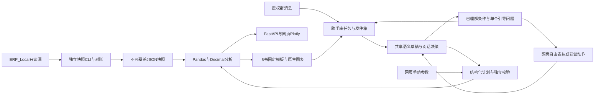

# 架构与实施规划

更新：2026-09-22。替代早期目标方案与已完成阶段执行清单。当前进度见[进度页](project-status.md)，测试证据见[验证记录](validation.md)。

## 目标与当前架构

当前提供ERP只读销售分析结果，服务平台内部运营。自然语言映射到有界分析计划，事实由本地程序计算。暂不做业务操作、任意SQL执行、自动经营决策或通用多Agent编排。



大模型通过独立语义接口解释问题，只见当前问题、消息日期、业务语义配置、结构化会话状态及服务端裁剪的能力和完整日期元信息。业务记录、名称目录、分析结果和身份不进入模型；程序合并条件、解析日期、检查能力，决定引导补充或转换为既有销售计划。手动分析、固定飞书指令和已绑定的建议动作可不调用模型。

## 实际模块

| 位置 | 职责 |
|---|---|
| `backend/app/connectors/` | 参数化SQL只读取数、字段映射和控制总数 |
| `analysis/sales.py`、`workers/analyze_sales.py` | 主明细对账、快照指标与独立生成命令 |
| `analysis/analytics.py`、`planning.py`、`charts.py` | 六类确定性分析、共享计划校验、网页图形 |
| `analysis/dialogue.py`、`semantic/dialogue_schemas.py` | 渐进引导、目标草稿、单个澄清问题、可验证的建议动作及渠道共享响应 |
| `schemas/analytics.py` | 日期、指标、步骤及结果契约 |
| `semantic/schemas.py`、`provider.py`、`prompt.py` | 独立语义契约、可替换云端适配器和结构化输出提示词 |
| `semantic/compiler.py`、`dates.py`、`context.py` | 结构化能力校验、会话补全、日期、销售计划转换和签名上下文 |
| `backend/config/semantic-catalog.json` | 四域术语、默认值、口径及当前执行能力，版本化维护 |
| `ai/analytics_agent.py`、`analytics_bounds.py`、`analytics_language.py` | 旧注入式计划器兼容、旧路径校验、共享口语说明 |
| `analysis/api.py`、`app/main.py` | 快照范围校验、目录、问答、手动分析和看板接口 |
| `integrations/feishu_analytics.py`、`feishu_sales.py` | 飞书问题、共享计算、持久化与原消息回复 |
| `integrations/feishu_jobs.py` | 独立助手SQL库、去重、租约、发件箱和追问 |
| `integrations/feishu_display_components.py`、`feishu_analytics_layouts.py`、`feishu_analytics_cards.py` | 同一integrations目录下的组件、六类模板、组合与容量降级；`feishu_analytics_text.py`保留文本回退 |
| `notifications/`、`workers/feishu_daily.py` | 日报预览、Webhook发送及独立可选调度 |
| `frontend/src/` | 看板、订单证据、口径、日报及AI分析页面 |

以上短路径均相对`backend/app/`，Worker相对`backend/`。历史三类销售解析与卡片代码保留用于兼容旧任务，不能因为文档合并直接删代码。

## 存储、口径和权限

- 源库：恢复后的SQL Server `ERP_Local`，仅授权对象只读取数。备份和安装介质在`database_backups/`，不属测试缓存。
- 快照：`.local/reports/`，保存范围、来源水位、对账状态、规则全文及指纹，生成后不覆盖。当前原始与经营两份快照均保留。
- 助手库：`ERP_AI_Assistant.erp_ai.feishu_sales_jobs`保存消息、任务、结果和发件箱；运行期不自动建库，初始化入口`scripts/init_assistant_db.py`。
- 业务口径：[指标定义](metrics-v1.md)、[数据字典](data-dictionary.md)、[业务假设](business-assumptions.md)分别维护，不再复制到各阶段计划。
- 网页使用绑定快照范围的本地令牌；飞书使用应用、租户、群和用户白名单。正式平台SSO和逐用户数据授权尚未接入。

每个分析计划1至6步，每步1至90个完整日，排行最多50项。比较期等长且不重叠；变化贡献保留“前N+其余”合计，波动规则不代表因果。真实分类或对象条件未接入时澄清，不能用金额替代销量。

## 执行与恢复

快照CLI承担源库读取。网页当前在请求线程池执行有界快照计算，没有持久网页分析队列。飞书事件回调只校验／入队，独立Worker解析、计算、先保存结果再发送；同一应用本地只运行一个连接进程。

助手任务使用消息／事件去重、租约及旧租约防覆盖；模型调用前保存中断标记，未知调用不重试；发送结果不确定记`unknown`，不能盲目重发。追问只继承同身份、同快照、30分钟内成功送达的结构化计划或语义澄清状态；清除请求按入队顺序形成屏障。

## 独立云端语义层（2026-09-22）

默认入口使用`SemanticPlanner`。`SemanticProvider.interpret(SemanticInput) -> SemanticRequest`是供应商无关边界：输入包含问题、消息日期／时区、结构化上下文和裁剪后的能力／完整日期元信息；输出为业务目标、带ID的待解决事项或明确编辑动作，最终草稿保持1至6个目标，不包含SQL、代码或业务数字。默认`CloudSemanticProvider`使用Pydantic AI和OpenAI兼容协议，复用根目录已有`ERP_AI_BASE_URL`、`ERP_AI_MODEL`、`ERP_AI_API_KEY`。兼容协议供应商可直接换配置；其他协议只需实现该接口并注入`SemanticPlanner(provider=...)`，无需修改计算器。

这是一层独立模块和HTTP接口，部署在现有后端中；没有本地模型、微调、额外数据库表或新增模型依赖。通常一次模型调用，结构校验最多一次修复，总请求最多两次；网络失败不自动重试。模型暂不可用返回服务错误，不能归咎于用户问法。

云端适配器对官方百炼地址显式控制思考模式：已确认支持低强度的`deepseek-v4-flash-0731`、`deepseek-v4-pro-0813`、`deepseek-v4.1-flash`启用思考并传`reasoning_effort=low`，其他百炼型号沿用旧接口的直接输出设置。通用兼容供应商不会收到这些适配参数。默认高强度曾触发25秒超时；完全关闭思考虽更快，但实测损失组合意图准确性，因此当前型号保留低强度思考。HTTP等待仍为25秒，整次理解仍为30秒，没有增加网络重试。失败日志只记录固定原因类别及耗时，不记录异常正文、问题、密钥或模型响应；用户分别收到超时、鉴权失败、繁忙、连接失败或无效结果提示。参数依据见[百炼官方说明](https://help.aliyun.com/zh/model-studio/deepseek-api)。

四域为`sales`、`returns`、`shipping`、`inventory`，与执行能力分开。销售六类及新增退货、销售出库、库存执行器按快照已加载的事实启用；旧快照仍仅提供销售能力。组合问题有任何不支持条件时先保留整个草稿，不默默返回销售子集；只有可分离目标并经用户明确选择，才删除本次不执行的目标。依赖关系或未解决事项不能通过拆分绕过。退款、库存、销量与有效订单金额不能互换。

会话以`new/followup/answer`区分新问题、追问和澄清回复。目标、筛选条件和待解决事项有稳定ID；编辑按ID定位，支持设置／清空字段、添加／替换／删除筛选和显式删除目标。未提到的目标及条件继续保留，目标不明时先澄清，不以数组位置猜测。模型通过`resolved_issue_ids`标记已解决事项；旧字符串字段仅作兼容。相同业务域的操作变更保留筛选与请求范围。已确定相对日期转换为绝对区间，跨午夜补充指标不会改变原统计日期。

中文单日、数字日期、中文区间、今天／昨天／上周／最近N天由`dates.py`确定性解析。今天根据消息日期，不使用快照末日；数据覆盖检查位于计划转换之后。日期最多90天，比较期等长且不重叠，执行器继续执行原有对账与范围检查。

网页上下文通过`conversation_token`往返，绑定本地工作区、快照和语义配置版本并在30分钟后过期。签名密钥独立保存在`.local/semantic-context.key`，仅在服务端使用；删除或更换该文件使旧会话失效。当前网页为本机免登录入口，不校验访问令牌，也未实现逐用户SSO隔离。飞书复用助手任务表的`semantic_notice`载荷，只有成功送达的提示可成为下一轮上下文。

按用户要求，语义配置v2只定义业务事实、指标含义、默认口径和能力，不再包含客户问法别名；提示词不依靠具体问句示例。模型负责业务域、目标、指标、对象、范围、筛选和歧义识别。已移除原`grounding.py`的中文正则意图裁决，以及根据原话推导排行条数的规则，避免正确语义因未收录的表达而被拦截。

模型输出`scope`表示请求范围，程序将其与实际授权快照比较；它不能扩大权限。`generic_product_scope`触发已约定的药品泛称口径说明，不再靠原话词匹配。客户没有明确衡量方式时程序应用业务默认；已明确的数量、金额、订单数不能互换。程序只校验结构化语义、执行能力、日期、会话及授权，模型遗漏原文条件的风险必须通过云端评测和真实反馈持续观察，不能宣称已被确定性规则完全消除。问句样本仅用于评测，不注入运行提示词。

飞书卡片2.0使用原生分页表格、VChart和折叠说明，客户端需7.20及以上。每卡最多5表格、2图表、200元素，JSON预算28KB；先去可选图形，再明确节选行数。展示不改变完整结果，完整报告链接待鉴权部署就绪后接入。

## 已实现：自由对话与渐进引导

已接入网页和飞书：客户用自然语言表达需求，助手组织目标草稿、补齐必要条件并执行分析；客户无需掌握指标术语、固定句式或一次性提供完整参数。继续使用现有云端语义接口和销售执行器，没有新增部署服务。验证及运行状态集中维护在[验证记录](validation.md)和[进度页](project-status.md)。

### 交互方式

自由对话配动态条件卡片：输入始终开放，条件卡片展示已理解的目标、明确条件、继承条件和默认值；建议选项是省输入的捷径，不限制可接受的表达。网页自然语言入口使用`/converse`，正常引导不再统一显示红色错误；旧`/ask`的422语义仅为兼容旧客户端保留。

### 核心交互规则

1. 每轮先保留已理解内容，区别用户明确条件、继承条件与业务默认；对外用业务语言简短说明。
2. 条件足够就直接执行。未明确指标但已有约定默认口径时，应用默认并说明，不为填满所有字段反复追问。
3. 只对会改变结果且不能合理确定的疑点提问；每轮最多一个关键问题，通常提供2—3个建议回答，同时允许自由补充、改意和跳过可选项。
4. 客户表达很宽泛时，先帮助确定想了解的业务目标，不直接要求填指标名称或重写完整问题。模型提出歧义和候选解释，程序结合真实能力筛选可用动作；必要时由程序生成具体引导。
5. 正常补充不是错误。缺信息显示对话卡片；数据不足、能力不足显示原因与可选路径；网络、模型超时和系统异常才显示错误与重试入口。
6. 不支持的条件不能通过更多追问伪装成可执行。明确说明能力缺口；更换指标、缩小范围、删除筛选或只执行组合的一部分，都需客户明确选择，不能自动替换。
7. 同一疑点连续两轮未解决时，展示已知条件和具体候选解释，允许逐项修改或换目标；不重复同一句通用提示。客户仍可继续自由对话，没有硬性两轮截止。

### 对话决策与职责

流程：用户消息／选项动作 → 语义理解或已绑定动作 → 目标草稿与能力检查 → 引导或执行。结果后的主动探索建议尚未接入，客户可继续自由追问。

模型负责理解自由表达、识别指代与修正、提出具体疑点和候选解释。程序根据结构化条件、业务默认、真实能力、日期覆盖和权限决定是否可以执行。具体疑点可由同一次模型调用产生，程序校验其候选动作；不增加每轮第二次模型调用来润色提示，也不新增独立Agent服务。语言理解和供应商可用性仍需持续评测，不保证所有表达都一次理解正确。

如果程序淘汰了模型提出的不合适选项，可直接根据结构化原因生成具体提示，不为补充文案再调用模型；这类输出格式规范不限制客户的输入表达。

语义输入已增加经服务端裁剪的能力摘要和完整日期范围：可执行业务域、分析类型、金额／订单数指标、是否支持对象筛选，以及是否覆盖全平台授权的布尔边界。不传业务明细、结果、客户身份、凭据或名称目录。内部可选动作ID不交模型推断展示编号，动作只由应用层验证。模型不能通过声称支持某项业务绕过执行器，也不能自行改变显式数据日期。

对话决策至少区分：

| 情况 | 助手下一步 |
|---|---|
| 可按明确条件或已约定默认执行 | 直接分析，并说明实际口径 |
| 缺必要信息或有实质歧义 | 说明已理解内容，提出一个具体问题 |
| 业务能力缺失 | 解释已理解的需求和当前限制，给客户可选择的替代目标 |
| 日期不在完整数据覆盖内 | 展示实际日期覆盖；由客户选择修改日期，绝不自动把今天换成历史日期 |
| 组合包含不支持部分 | 保留全部目标，询问是否先执行明确可分离的部分；相互依赖的条件不能拆开假装满足 |
| 请求超出授权 | 保持权限边界，可引导使用已有授权范围，不能通过选项扩权 |
| 系统或模型故障 | 保留草稿，显示准确故障类型；用户可重试 |

### 会话与接口契约

`target`表达业务分析维度，允许非空、最多80字符的名称，常见维度使用配置中的标准ID，未收录维度仍可保留原名；它不是执行能力白名单。`filters`表达限制范围，两者分开。编译器在生成计划前拦截未支持维度，当前仅商品／客户可执行，底层分析类型及权限没有扩大。地区等能力缺口提供需明确选择的替代建议，不省略维度或默认改成商品。

共享响应和语义草稿使用带稳定ID的目标、约束及待解决事项：

```text
DialogueTurn
  status: result | needs_input | capability_gap | data_gap
  understood_summary
  draft: intents[id, fields, constraints[id], field_sources]
  clarification: id, intent_id, field, kind, question
  choices: id, label, action
  applied_defaults
  available_dates: start, end_exclusive
  repeated_clarification
  allow_free_text: true
  conversation_token
  result: 可选，复用现有分析结果
```

`field_sources`区分explicit、inherited、default；`clarification`只呈现当前最关键事项，其余保存在草稿中。选择动作是受校验的条件补丁，不拼接模板问题再重新识别。客户自由回答仍交模型理解，再转换为相同补丁协议。

按目标／条件ID设置、替换、添加和明确删除条件，按待解决事项ID解除歧义。没有提到的条件继续保留；删除须由用户明确表达并形成编辑动作，或选择服务端提供的允许动作。自由表达的明确修正可直接修改草稿，无需再要求点击确认同一句话。旧无ID会话和旧字符串字段保留兼容，不能将兼容逻辑作为新多目标编辑的依据。

追加分析通过`add_intents`表达，保留原目标，总数仍最多6个；只沿用唯一共同的已核验日期，范围／筛选存在差异时继续引导。目标暂未定位的修改保存在`pending_request`中，供下一轮模型结合用户选择重新提交，不直接执行；其中的日期必须先经原话核验。已知草稿的可见摘要保留未解除的关联限制及待定位修改，过期后恢复也不能静默遗失这些条件。

已新增`POST /api/v1/analysis/converse`，一次请求完成理解、对话决策及必要时执行；`result`、`needs_input`、`capability_gap`、`data_gap`均返回200。既有`/ask`、`/interpret`和`/run`保留兼容。请求发送`question`或`choice_id`之一及可选`conversation_token`；`date_range`动作另传`date_range.start`和不含终点的`date_range.end_exclusive`。完整示例见[接口说明](analysis-assistant.md#开发接口与验证)。

选项允许动作保存在签名上下文内，绑定对话轮次、目标、字段及可解除的事项ID；客户端只提交选项ID及该动作允许的日期参数。服务端验证后执行，不重新调用模型。沿用30分钟有效期及快照隔离；`/converse`遇失效上下文返回409 `context_expired`，失效动作返回409 `choice_expired`；参数错误422，模型服务故障503。本机网页无需访问令牌，飞书仍校验应用／租户／群／用户授权。客户端取消旧请求并防止旧响应覆盖新草稿。

### 网页与飞书呈现

网页在输入框附近显示已理解内容、当前问题、建议选项和自由回答区域。日期可用日期选择器，目标和指标可用建议按钮；点击已确定条件把修改提示放入输入框，供用户补充后提交。会话失效时保留页面当前草稿和未完成补充，用户点击「恢复这份草稿」才作为新问题重新理解；不静默套用失效令牌，也不保证刷新或关闭页面后的草稿持久化。结果复用原有表格与图形。

飞书共享同一对话决策，使用普通蓝色说明卡片与编号选项，客户可自由补充或修改。完整引导响应随任务持久化，仍只有成功送达的轮次可以继承；恢复已保存提示不重新调用模型。网页日期选择器动作在飞书隐藏，剩余建议重新编号。当前没有卡片点击回调或引用卡片编号定位，后续接入时再复用同一动作协议。

纯数字回复仅接受同身份30分钟窗口、清除屏障之后的唯一待答轮次，且最近语义任务已成功送达。中间出现新问题、多轮建议、未知送达或过期时，保留可用草稿并请客户用文字说明选择，不将旧编号套到新选项。

### 实施范围与持续评估

已实现引导闭环：结构化待补事项与单问句、统一对话响应、网页条件卡片、自由回答、飞书编号建议，区分正常引导与系统错误。

已实现条件显式修改／删除、按目标ID处理组合、能力缺口的可选路径、重复澄清提示与网页上下文过期恢复，并接入退货／销售出库／库存事实和执行器。后续建设包括结果后的探索建议、飞书卡片点击回调、资金退款与退货率、库存历史与周转；这些仍未接通。

验收关注客户能否继续完成任务：不同表达能否达到相同语义结果，短回答能否补齐条件，明确修正能否覆盖旧条件，不相关条件是否保留，不支持请求是否给出真实可行的下一步。覆盖跨域、组合、日期缺口、模型故障和送达失败；分别记录任务完成率、平均澄清轮数、重复提问率、无必要澄清率、约束遗漏率与响应时间，不以“模型返回了JSON”当作理解成功。

独立评测入口`evaluation/dialogue.py`复用现有`converse`，生产请求不依赖评测集。版本化JSON存放来源、固定提问日、每轮问题、离线参考语义和独立验收标签；回放模式验证程序链路，显式云端模式验证供应商输出。报告保留版本哈希、状态、错误类别和耗时，失败后跳过依赖轮次且不计为通过。当前完成场景通过率及引导／字段偏差统计，真实用户任务完成率和长期约束遗漏率仍需扩充标注流量，不能用种子集推算。

输出形态由模型区分整体汇总、对象列举、相对排行和是否发生；条件不全时也要保留已理解的形态。对象确有歧义可具体澄清，不能直接降级为概览。日期已明确但数据未覆盖时，语义层保留日期，程序负责数据缺口引导。评测可人工标注不同但合理的澄清路径，仍要求每条路径满足完整目标和约束，不以某一种表述作为客户问法限制。

复合筛选按每个明确条件分别表达，包含与排除分开；不能依据模型猜测的分类关系将条件视为冗余而省略。当前对象筛选仍未接入执行器，完整保留条件后说明能力缺口，不能为了可执行而删除条件。

## 后续建设条件

近期任务按[进度页](project-status.md)的P0／P1／P2顺序执行，不另维护第二套清单。

数据更新先确定增量水位、源主键、删除和历史修正语义；按受影响时间／企业重算并对账，不能只补新订单或把状态更新当新增成交。变更尚不一致时不发布完整快照。

生产运行需进程守护、备份、日志轮转、任务保留期及告警。网页长期分析确有需求时再复用持久队列；权限与结果缓存必须同时匹配范围、规则版本和数据水位。支付退款、利润、库存等能力先补事实映射和口径，再扩展模型工具。

继续使用Pandas，先限制SQL范围、精度和内存，记录真实分析耗时、峰值内存及并发。全局去重、均值和排序不可简单合并分块结果。只有压测超出容量目标时才评估独立分析库、预聚合或分布式引擎；早期讨论的CDC、Kafka、Doris等均未实施，不属于现有运行依赖。

## 重新生成快照

从`backend/`执行，只读源库并写新的本地快照：

```powershell
../.venv/Scripts/python.exe -m workers.analyze_sales --start 2026-09-01 --end 2026-09-17 --source-as-of 2026-09-16T14:33:41+08:00 --all-buyers
```

日期含起点、不含终点，取数CLI最多366天；分析工具的90天限制是另一层约束。必须明确全平台或指定企业范围。来源截至时间必须真实，不能把刷新运行时间当作数据水位。输出路径默认新文件，`--output`不能覆盖已有快照；改规则后重新生成，再让服务加载新路径。
## 四域执行接入（2026-09-22）

沿用独立语义接口、签名会话和只读快照，在 `SalesReport` 增加可选业务事实包；旧销售快照仍可读取，缺少业务事实时明确提示重新取数，不把未加载的数据视为零。模型不接收事实明细。

- 退货：`XSTHDH/XSTHDB`，以退货单创建日期统计已完成退货单，按原销售单校验客户关系；展示金额、单据数、按单位分开的数量。不是资金退款，不计算未经定义的退货率。
- 出库：`CKFHQRH/CKFHQRB` 已确认的销售出库（`CKLX=售出`），采用确认日期 `SHRQ`，关联原销售单。采购退出单分开，不混入销售出库。已只读核验销售出库确认日期与原订单发货出库日期同日、主明细金额及数量一致。
- 库存：`SPPHGLBH.KCSL` 商品批次余额，按 `SPBM` 关联商品档案取得名称、单位；库存时点为备份截至时间。只支持全平台已授权范围，不能用采购企业权限推导仓库库存权限；不伪造仓库归属、历史日结库存或周转率。
- 执行：扩展受约束计划的业务域，按域分派；退货、销售出库支持概览、趋势、商品／客户排行、明细和有无记录，库存支持单时点概览、商品排行、明细和有无库存。组合请求全部校验后执行；数量分单位统计、分单位排行并明确展示截取边界。
- 会话：沿用自由输入和稳定目标 ID；缺日期、指标歧义继续引导，能力由已加载事实决定。库存查询明确展示备份时点，今天不能自动改成历史余额；用户可明确选择现有快照。
- 展示：网页和飞书共用业务结果，标明业务域、日期依据、计量单位与来源。新业务证据与销售订单 ID 分开，避免点击到同号销售单。

实施顺序：① 合成测试和事实／计划契约；② 固定只读连接器及对账；③ 分域计算、语义转换和会话引导；④ 网页／飞书展示；⑤ 全套回归、生成新快照、重启和本地接口验收。重点验证跨单位求和、重复关联、越权、空数据与缺数据、库存日期、组合问题和错误证据链接。继续使用现有架构，不新增模型部署、业务写入或调度基础设施。
