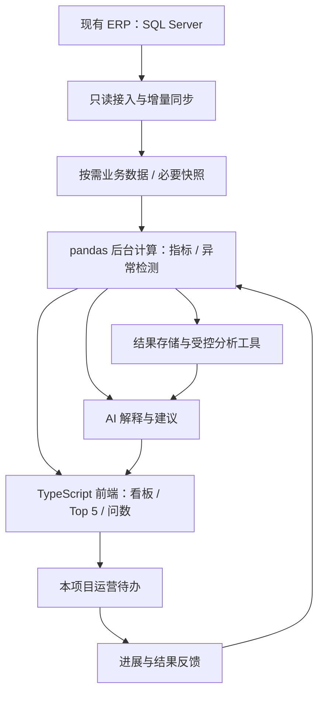
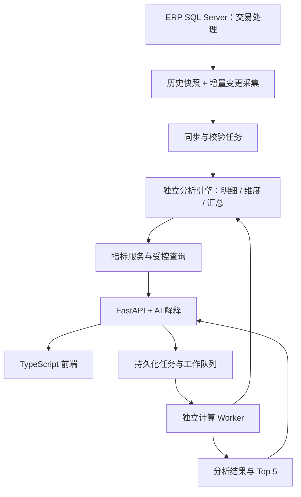

**B2B 平台 AI 经营分析助手：独立项目方案**

版本：讨论稿 v0.4；日期：2026-09-14。项目入口见 [README](../README.md)，开发与测试约定见 [AGENT.md](../AGENT.md)。

已确认：已有 ERP，业务数据库为 SQL Server；平台连接入驻供应商与采购企业，覆盖多个行业；本项目独立建设，前后端分离，后端采用 FastAPI，前端使用 TypeScript，Web／桌面形态尚未确定。当前阶段使用 pandas 作为数据计算框架。当前仓库尚无业务代码，未接入真实数据库。暂按第一版服务平台内部管理者与运营人员设计；SQL Server 版本、数据规模和部署要求待确认。周期、指标阈值和验收门槛均为规划建议。第 14 节保留为未来规模扩展参考，当前实施以 pandas 方案及第 15 节为准。

**1. 产品定位**

建设一个独立的“平台经营分析中心”：从 ERP 获取可信数据，自动发现值得关注的问题和机会，支持自然语言追问，给出证据和可执行建议。

每天回答六个问题：成交有什么变化、哪些采购企业需要跟进、哪些供应商表现异常、哪些商品或品类有机会、依据是什么、由谁继续处理。

产品包含三个相互连接的入口：经营驾驶舱查看现状；今日 Top 5 提醒优先事项；AI 问数深入分析。支持从事项直接打开相关企业、商品、订单和运营待办。

交易双方的数据均存在于平台，不代表任何一方都可访问对方或同行的全部经营数据。第一版面向平台内部，后续对供应商和采购企业开放时分别定义数据产品与授权范围。

**2. 第一期功能范围**

| 功能 | 用户能得到什么 | 必需数据 | 阶段 |
|---|---|---|---|
| 成交概览与异动分析 | 按天／周／月查看成交额、订单数、采购企业数、客单价，拆解变化集中在哪些企业、供应商和品类 | 订单、订单明细、企业、商品，以及可用的支付／退款数据 | 一期 |
| 采购企业复购分析 | 识别超过自身历史采购间隔仍未复购、采购规模持续下降的企业 | 企业身份、订单、足够长的采购历史 | 一期 |
| 供应商成交表现 | 成交趋势、活跃采购企业、商品贡献、取消情况 | 供应商、商品、订单、状态历史 | 一期 |
| 商品与品类分析 | 识别热销、增长、下降、成交集中度变化 | 标准商品／SKU、品类、订单明细 | 一期 |
| 今日 Top 5 与运营待办 | 将上述分析结果聚合排序，保留证据、负责人、处理状态 | 统一指标及分析结果 | 一期 |
| AI 问数 | 在已定义指标范围内提问、看图表、下钻订单、继续追问 | 指标服务、业务字典、权限 | 一期 |
| 履约与售后分析 | 比较按期发货、完成时长、退款与争议表现 | 约定交期、实际物流节点、退款／售后记录 | 数据具备后扩展 |
| 搜索／询价到成交漏斗 | 发现找不到商品、询价未成交等供需机会 | 可关联的搜索、浏览、询价、报价、订单事件 | 二期 |
| 智能供需匹配 | 推荐符合品类、交期、价格等条件的供需候选 | 真实采购需求、供应能力、商品映射和双方授权 | 二期 |

库存积压、批次效期、企业应收等功能需要确认平台是否管理这些数据和流程，再决定是否纳入。平台 GMV、供应商销售额、平台佣金或服务收入分别定义。

**3. 页面建议**

| 页面 | 内容与操作 |
|---|---|
| 经营首页 | 时间与业务范围、数据更新时间、核心成交指标、趋势、今日 Top 5、待办进度 |
| 销售分析 | 按采购企业、供应商、商品、品类、地区下钻；比较周期与贡献 |
| 企业分析 | 采购企业采购轨迹与复购；供应商成交、客户覆盖及有据可查的履约表现 |
| AI 问数 | 问题、当前筛选条件、答案、图表、指标定义、证据链接、连续追问 |
| 事项与任务 | 事项历史、负责人、复查时间、进展和处理结果 |
| 数据与规则配置 | 数据接入状态、指标字典、异常阈值、权限、反馈和版本 |

每条 Top 5 卡片展示：发生了什么、影响范围、关键数值、对比口径、数据时间、依据、建议动作、负责人。点击后查看详细拆解，再按需要追问。

以下仅展示表达结构，内容为假设示例，没有读取真实 ERP 数据：

- 本周成交下降主要集中在几家核心采购企业，建议运营人员查看企业级变化并核实采购安排。
- 某采购企业超过其历史常见复购间隔，建议客户经理跟进近期采购计划。
- 某供应商多个主要商品连续下滑，建议查看其主要采购企业与商品构成变化。
- 某品类增长集中在少数大额订单，建议确认需求是否持续，避免直接外推长期增长。
- 若存在交期数据，某供应商待履约订单已超过约定时间，建议运营人员协调处理。

Top 5 从实际事项中选择，不要求每天都覆盖五种类型或凑满五条。数量概览与展示条数分别标注。未接入、同步失败、数据过期不能显示为“其他正常”；业务强制提醒级别的事项另行置顶，避免受五条上限限制。

**4. 项目架构**



项目独立拥有前端、服务端和应用数据库。ERP 是业务事实来源；pandas 后台任务读取经过日期、字段和权限范围筛选的数据，计算结果持久化到助手库。项目保存必要的数据快照、指标结果、问题记录、会话、任务和反馈，按实际分析需求决定需要同步的明细范围。一期通过企业／商品／订单标识跳回 ERP 查看原单；若以后需要修改业务单据，再接 ERP 正式业务接口。

建议采用分模块应用加后台任务进程：数据接入、指标计算、异常检测、AI 编排、问数工具、事项任务、权限审计。现阶段按模块划分职责，随着数据规模与团队需要再拆分部署。

固定分析任务采用可预测的工作流：取数、计算、验证、解释、呈现。开放追问由模型选择受控工具。这一划分参考了 Anthropic 对工作流与自主代理的架构说明。[架构参考](https://www.anthropic.com/engineering/building-effective-agents)

**5. 数据库怎么接**

| 接入方式 | 适用条件 | 实施要点 |
|---|---|---|
| 现有只读副本／报表库 | 已经具备，或查询规模较大 | 优先利用；监控同步延迟和来源水位 |
| 主库授权只读视图／受限账号 | 小范围验证且 ERP 维护方确认承载能力 | 限定表、字段、时间窗口、并发、查询时长，并选择低峰同步 |
| ERP 业务 API | 数据库不能直接访问或指标涉及复杂业务逻辑 | 处理分页、限流、变更与删除／取消状态 |
| 脱敏数据快照 | 接入前验证和界面演示 | 标明快照时间与覆盖范围 |

试点可先每日更新一次晨报，按需增加小时级汇总。具体频率根据运营使用方式和数据库负载确定。

首次按约定时间范围同步历史数据；后续使用更新时间与稳定 ID 增量读取并去重写入。必须覆盖状态回退、取消、退款、软删除及迟到数据；只依赖最大 ID 会漏掉旧订单更新。若没有可靠变更字段，则采用周期对账或由 ERP 维护方提供变更接口／日志。

同一次分析固定统计截至时间，保存各数据源同步水位。快照并非天然一致，跨表同步需要一致性机制或事后对账。旧订单收到退款等新信息后，重算受影响的历史汇总。

针对 SQL Server：先检查是否已有报表库、可靠更新时间、软删除标记或变更同步机制。需要补充机制时，可由 DBA 评估 Change Tracking 等方式；Change Tracking 可记录变更行的主键，具体数据仍需读取源表，因此还需处理删除、同步水位和保留期失效后的重新初始化。它属于数据库接入实施选项，需结合真实版本、配置与运维要求确定。[SQL Server 增量同步参考](https://learn.microsoft.com/en-us/sql/relational-databases/track-changes/about-change-tracking-sql-server)

**6. 先建立业务字典和指标口径**

模型需要理解真实业务语义：哪张表是主订单、哪张表是供应商子订单、哪些状态代表有效成交、何时算支付成功、退款怎样关联、企业怎样区分角色。可以读取数据库元数据辅助建立表与字段映射，但字段名本身不足以确定这些口径。SQLAlchemy 提供数据库对象反射和检查能力，可用于后续接入工具；最终仍需与 ERP 业务规则核对。[数据库元数据参考](https://docs.sqlalchemy.org/en/20/core/reflection.html)

最小数据清单如下，表名均为逻辑名称，需映射到真实库表：

| 数据对象 | 关键字段与用途 |
|---|---|
| 企业与角色 | 企业 ID、供应商／采购方角色、注册日期、地区、状态；同一企业可能具有双重角色 |
| 主订单与供应商子订单 | ID、父子关系、采购方、供应商、下单／支付／取消／完成时间、状态、金额、币种 |
| 订单明细 | 行 ID、订单／子订单 ID、SKU、数量、单位、实际金额、行优惠及相关费用 |
| 商品与品类 | 平台标准商品、供应商 SKU、品类、规格和单位换算；不存在标准映射时不能直接跨商家比较 |
| 支付与退款 | 交易 ID、订单关联、金额、成功时间、状态；仅在平台实际记录时使用 |
| 履约与售后 | 约定和实际节点、退款原因、争议状态；支持后续扩展 |
| 平台收入与结算 | 佣金／服务费／结算明细；只有存在该数据时才分析平台收入 |

建议先定义 10—15 个核心指标，每项记录名称、业务含义、计算公式、数据来源、时间字段、统计粒度、过滤状态、币种、权限和版本。

- 下单金额与支付成交额分别统计；仅有订单数据时，展示已确认的订单口径，不能假定平台掌握实际收款。
- 支付成交额按成功支付事件或已核实的订单支付口径计算，处理分次支付，避免重复汇总订单金额。
- 当期实收减退款按资金事件日期计算；某批成交订单扣除其累计退款按订单归属期计算。两者分别命名，并标明统计截至时间。
- 订单数明确主订单还是供应商子订单。平台订单数可按主订单去重，供应商分析按子订单统计；供应商订单数求和不能直接当作平台主订单数。
- 连接订单、明细、支付和退款等一对多表时，先按相应粒度汇总，再关联，避免金额成倍放大。
- 成交客单价的金额与订单数使用相同范围和粒度；采购企业数按企业身份去重。
- GMV 与平台营业收入分别呈现；佣金收入需要实际计费和退款冲回规则。
- 跨币种默认分开分析；需要合并时确定汇率日期及来源。金额按 ERP 精度与舍入规则计算。
- 新采购企业与复购企业需说明历史覆盖范围；历史不完整时只能称“观察期内首次采购”。

**7. AI 怎样可靠地问数**

推荐一期采用“自然语言 → 已定义指标和维度 → 受控查询工具 → 数据结果 → 图表与解释”的链路。

例如用户问：“本月销售为什么下降？”

1. 确定其授权范围和默认销售口径，将“本月至今”与上月相同已过天数或可比工作日比较，并展示所用对比方式。
2. 查询成交额、订单数、采购企业数和客单价，检查同步完整性以及上期为零等边界情况。
3. 按采购企业、供应商、品类分别拆解变化贡献，关联可用的订单、退款、取消等事实。
4. 返回结论、趋势图、贡献明细和订单入口。不同维度的贡献不可再次相加，避免重复解释同一变化。
5. 若数据只能说明变化集中在哪里，就表达为“变化贡献／关联线索”；缺少活动、报价、库存或客户反馈时，不直接断言真实业务原因。

可先提供以下示意工具：`sales_summary`、`sales_breakdown`、`buyer_repeat_analysis`、`supplier_performance`、`product_trends`、`order_evidence`。参数包括已批准的指标、日期范围、分组和筛选条件；服务器根据登录身份注入并校验权限。

模型负责理解问题、选择工具、解释结果；当前由 pandas 分析函数负责金额、比例、排序和趋势计算，SQL Server 负责受控取数与结果存储。已有结果可以直接查询，新的计算请求交由后台任务处理。模型接收结构化结果与必要证据，数据库凭据留在服务端。

遇到口径存在关键歧义时，展示可选解释或简短澄清；遇到未支持指标、缺失字段或权限不足时明确说明范围。连续追问保存上一轮的时间、主体和筛选条件，切换时让用户看得见。

自由生成 SQL 可作为后续能力，在隔离的分析数据上配合表／字段许可范围、SQL 校验、查询成本限制和执行器权限实施。数据库只读只能限制部分写入风险，不能代替数据权限和查询资源控制。

结构化销售数据通过受控 SQL 读取，并由 pandas 指标服务计算；制度、商品说明等文档有明确需求时再接入知识检索。模型输出中的金额、日期和证据引用由服务端校验；模型失败时仍展示可靠数据和模板摘要。

**8. Top 5 的产生与后续处理**

一期先做好三组检测器：成交异动、采购企业复购异常、供应商／商品成交异常，复用统一指标层。

成交异动采用同长度、可比周期，并考虑周内规律、节假日、活动与大额订单影响。低基数导致的高增长率单独标记。B2B 企业的采购周期差异较大，复购提醒尽量与企业自身历史间隔及同类企业对照；少量历史样本仅给观察提示，不直接贴“流失”标签。

检测器输出结构化信号，再按企业／商品／订单、事件类型和时间范围聚合为经营事项。平台总成交下降与某企业采购下降可能源于同一变化，应在详情中关联，避免首页重复占位。排序依次考虑业务严重程度、处理时效、影响范围与金额、持续恶化程度、是否已有人处理。

金额、预测收益与潜在机会分开保存。没有经过校准时不输出“流失概率 90%”等概率断言。可解释的规则与业务验证先于复杂评分。

事项保留稳定 ID、首次／最近发现时间、证据快照、规则版本、负责人和状态。每日更新已有事项，不重复创建相同任务。允许用户标记有效、已知情况、误报、暂缓复查，并记录原因。

第一版的动作落在本项目待办内，例如“客户经理核实采购计划”“供应商运营核实商品变化”。暂按以下状态流转：待认领 → 处理中 → 待复核 → 已结束。标记结束时记录业务结果；任务结束不自动意味着成交恢复或收益已实现。

**9. 权限与运行方式**

第一版接入平台内部账号或与 ERP 单点登录对接。身份验证与数据范围在服务端统一执行。平台运营人员也按其实际授权访问公司、地区、品类及敏感字段；日志、缓存、会话历史、汇总和导出使用相同权限边界。

后续面向商家开放时，供应商只能查询获授权的本企业成交数据，采购方只能查询获授权的采购数据；跨商家的对比或撮合结果需要单独定义可披露内容。仅让模型在提示词中“记得过滤企业 ID”不足以形成隔离。

上述设计参考 OWASP 对最小权限及下游鉴权的建议。若后续引入正式业务动作，执行权限继续由业务系统验证，并沿用原有审批。[权限参考](https://genai.owasp.org/llmrisk/llm062025-excessive-agency/)

商品说明、供应商备注和外部文档作为数据输入，不能改变工具权限和运行规则。限制单次查询范围、超时时间、结果行数及模型调用次数，并记录同步延迟、分析耗时、调用费用、错误及反馈。

**10. 技术选型建议**

已确定后端 FastAPI、计算框架 pandas 和前端 TypeScript。建议的技术分工如下：

| 层次 | 方案 | 说明 |
|---|---|---|
| 前端 | TypeScript；建议先 Web，React／Vue 在界面阶段确定 | 看板、表格、趋势图、问数与待办 |
| API | FastAPI + Pydantic | 定义请求／响应契约、身份与数据权限、业务服务 |
| 数据计算 | pandas | 清洗、分组汇总、趋势比较、采购间隔与异常规则 |
| SQL Server 接入 | SQLAlchemy + pyodbc + 适配部署环境的 Microsoft ODBC 驱动 | 源库只读连接与助手库读写连接分别配置 |
| 分析与应用存储 | 建议独立 SQL Server 数据库，实例位置按运维条件决定 | 保存必要的分析表、汇总、会话、事项、任务和同步水位 |
| 后台任务 | 独立 Python worker／调度进程 | 执行 pandas 分析、按需同步、指标重算、每日 Top 5；先按低并发实施 |
| AI 层 | 模型 API + 受控工具调用 + 输出校验 | 先评测再确定模型，保留供应商适配边界 |

SQLAlchemy 官方文档提供 SQL Server 的 pyodbc 接入方式，可作为实现依据。[数据库驱动参考](https://docs.sqlalchemy.org/en/20/dialects/mssql.html#module-sqlalchemy.dialects.mssql.pyodbc)

pyodbc 为同步调用路径：在 FastAPI 中使用合适的同步路由／线程执行方式，不能在异步路由中直接执行长时间阻塞查询；批量同步和大分析任务由 worker 执行。FastAPI 对同步路径函数与异步函数的执行方式有明确说明。[并发参考](https://fastapi.tiangolo.com/async/)

源库账号只获得约定对象的查询权限；助手库连接负责写入本项目自己的表。若两个数据库部署在同一 SQL Server 实例，仍共享 CPU、内存和 I/O，逻辑分库不能替代负载隔离。先记录查询计划与负载，再决定是否使用独立实例或报表副本。

前端建议先做 Web，因为当前业务已经在网站上，内部试用和后续发布可通过浏览器完成。需要本地设备、操作系统集成或明确离线能力时再评估桌面形态。前端把数据访问、图表、业务组件与平台特有能力分离，桌面版本可以继续调用同一 FastAPI 服务；离线分析则需要另行设计本地数据和同步。

FastAPI 以 OpenAPI 描述接口，前端可以据此生成 TypeScript 客户端，减少手工维护两套字段定义。无论 Web 还是桌面，都使用相同的接口及服务端权限规则。[TypeScript 客户端参考](https://fastapi.tiangolo.com/advanced/generate-clients/)

一期按固定流程调用模型 API，维护统一工具协议、提示版本和评测样本。只有出现复杂流程需求时再引入额外编排框架；缓存、队列和专用分析引擎按负载决定。

模型通过脱敏业务问题评测后选择，比较中文理解、工具选择、数值引用、连续追问、响应时间、费用和部署要求。数据是否可发送至外部模型服务需要在实际部署前确定；若需要内网处理，则评估本地模型和相应算力。当前不预设供应商及费用。

**11. 实施顺序与周期**

以一套 ERP、平台内部用户、订单相关核心数据、上述三组检测器及受控问数为试点范围，在有业务／ERP 配合、约 1 名前端和 1—2 名后端／数据／AI 工程师、测试支持的条件下，可先按 5—7 周估算。接入、数据治理和历史回补工作量可能延长周期，需在第一阶段修订。

| 阶段 | 工作内容 | 可评审结果 |
|---|---|---|
| 第 1 周 | 梳理表结构、主子订单及支付退款关系，明确指标和权限；确定页面原型 | 业务字典、字段映射、10—15 个指标定义、原型与样例问题 |
| 第 2—3 周 | 只读接入、历史与增量同步、指标计算、看板与明细 | 可与 ERP 对账的看板，具有数据更新时间和证据入口 |
| 第 4—5 周 | 受控问数、三组检测器、Top 5、运营待办 | 可用试点，支持从结论到原单及任务 |
| 第 6—7 周 | 业务试用、边界案例回放、规则调整、运行验证 | 评测报告、运维说明、发布范围和二期清单 |

采用脱敏快照的页面与问数演示可优先安排 1—2 周原型阶段；演示结果需明确为样例，真实数据准确率与运行稳定性另行验证。

第一步最有价值的输入是订单、订单明细、企业、商品等核心表结构及状态说明；有支付退款数据时一并梳理。凭据通过部署环境管理，讨论方案无需提供生产密码。

**12. 验收与业务价值**

准备一组经业务人员核对的标准问题和历史事项，开发样本与评测样本分开。试点可先使用 30—50 个代表性问数问题和 50—100 个历史正常／异常案例；样本不足时报告实际覆盖情况。历史检测只使用当时可获得的信息，避免把后续结果带入输入。

建议验收内容：

- 指标可与 ERP 对账，覆盖跨月退款、取消、拆单、多次支付、一对多连接、零基数和单位／币种等实际存在的边界。
- 每个关键结论可回查指标、对比期、数据截止时间及业务依据；没有数据时不编造数值或原因。
- 问数评测分别检查指标选择、筛选条件、权限、计算结果与文字解释；总体通过率先由试点基线确定，关键金额对账必须正确。
- Top 5 有效率可先以 80% 作为讨论目标，同时复盘漏掉的重大事项，避免单纯追求少报。
- 多角色的查询、下钻、会话和缓存无越权；增量重跑和重复操作不会放大成交数据或重复创建任务。
- 同步失败和模型不可用时明确展示状态，已计算事实仍可读取；运行耗时与查询负载符合试点约定。

跟踪运营人员查数耗时、主动分析使用率、有效事项比例、任务跟进率和处理时长。成交恢复、复购改善等业务结果单独验证，结合历史同期、活动或对照分析；观察到改善不等于已证明由 AI 导致。

下一步实施前需要收集：SQL Server 版本、订单及历史数据量、核心表结构和状态说明、可用只读接入方式、内部用户范围、部署环境与数据出网要求。前端形态可以在后端与指标设计推进过程中确定。

**13. 建议项目结构与首批接口**

以下为规划结构，当前尚未创建业务代码：

```text
erp-ai-assistant/
  README.md            # 项目介绍与当前状态
  AGENT.md             # 技术决策、开发与测试约定
  backend/
    app/
      api/             # HTTP 接口
      core/            # 配置、认证、日志
      db/              # ERP 只读连接、助手库读写连接
      connectors/      # SQL Server 表与业务对象映射
      metrics/         # 指标定义、计算和口径
      analysis/        # 变化拆解、复购与异常检测
      ai/              # 模型适配、工具定义、结果校验
      insights/        # 事项聚合、排序、状态
      tasks/           # 运营待办与反馈
      schemas/         # API 数据契约
    workers/           # 同步、重算和晨报调度
    migrations/        # 仅管理助手库表结构
    tests/             # 指标、权限、同步和问数评测
  frontend/
    src/
      api/             # TypeScript 客户端与请求适配
      features/        # 看板、问数、企业分析、事项
      components/      # 通用表格与图表
  docs/                # 方案、业务字典、接口及部署说明
```

| 接口示意 | 用途 |
|---|---|
| `GET /api/v1/dashboard/summary` | 看板指标与数据时间 |
| `GET /api/v1/sales/trends` | 趋势与比较周期 |
| `GET /api/v1/sales/breakdown` | 按已批准维度分析贡献 |
| `GET /api/v1/insights/today` | 今日重点事项 |
| `GET /api/v1/insights/{id}` | 证据、口径、历史与关联任务 |
| `POST /api/v1/analysis/questions` | 提交受控问数请求，返回答案或分析任务 ID |
| `GET /api/v1/analysis/jobs/{id}` | 获取长分析任务状态与结果 |
| `POST /api/v1/tasks` | 创建本项目运营待办 |
| `POST /api/v1/insights/{id}/feedback` | 保存有效性反馈 |

接口响应统一携带授权范围内的数据、指标／规则版本、统计截至时间和证据标识；列表分页，长任务异步返回状态。与模型的工具协议复用这些业务服务，HTTP 接口和 AI 工具都执行相同的数据权限校验。

**14. 未来规模扩展参考**

本节记录超过当前 pandas 方案容量后的候选架构，不属于当前建设范围。是否采用这些组件，以 pandas 实际运行的峰值内存、耗时、并发与维护成本为依据。当前尚未获得实际行数、存储体积、日增与日更新量、查询并发及允许的数据延迟，因此不按固定行数直接决定是否上集群。

总体设计为：交易与分析负载隔离，数据增量同步，常用指标预计算，交互查询由分析引擎完成，长任务异步执行，AI 只接收与问题相关的聚合及证据。



变更量大、多个消费者需要订阅或需要独立重放时，可在采集与同步任务之间引入 Kafka 等持久化事件管道。分析引擎先使用独立 SQL Server 分析实例作为基线，实际压测不达标时再评估 Doris 等分布式分析数据库；上述模块边界保持一致。

**14.1 分工与数据层次**

| 层次 | 保存或计算什么 | 扩展方式 |
|---|---|---|
| ERP 交易库 | 下单、支付状态、取消、退款等业务事实 | 保障交易资源，评估采集负载 |
| 原始与标准明细 | 必要的来源记录、变更序号、去重后的订单／支付／退款事实、企业与商品维度 | 批次加载、分区、重放与对账 |
| 分析计算层 | 大范围过滤、关联、聚合、趋势与企业指标 | 列式存储、合适分区与分布键，必要时多节点并行 |
| 指标汇总层 | 按日期、企业、供应商、品类等常用粒度预先汇总 | 增量更新、受影响分组重算、物化视图 |
| API 与结果层 | 快速取数、权限、结果缓存、任务进度 | 无状态 API 实例扩容、数据库连接预算、缓存隔离 |
| Worker | 批量同步、长分析、历史回补、检测器与晨报 | 有界并发、任务分片、独立资源池 |
| AI 层 | 理解问题、选择受控工具、解释聚合、引用少量必要证据 | 限定上下文、工具调用次数和费用，复用可用分析结果 |

大范围 SQL 尽量在分析引擎内执行，只把需要的结果返回应用。Python 负责业务算法和编排，需要自定义批量计算时采用有界批次或相应计算引擎，避免将整张订单表拉入 FastAPI 进程内存。

分布式分析引擎可以将表数据分布到多个节点，各节点执行局部扫描与聚合，再合并结果。跨表关联、数据倾斜、全局去重和网络交换仍可能成为瓶颈，因此“增加节点”需要配合数据模型及查询设计。

**14.2 预计算如何减少工作量**

假设有一亿条历史订单明细，要展示某个固定平台范围的一年成交趋势，可以先按确定口径维护每日成交汇总；前端读这一范围内最多 365／366 个日汇总结果。订单明细仍用于证据下钻和未覆盖的分析条件。这是计算方式示意，不是性能承诺。

首批可建设平台日成交、供应商日成交、采购企业日成交、品类日成交，以及企业最近采购时间与历史采购间隔等汇总。常用查询命中汇总，新的筛选组合回退到分析明细；只为实际高频查询建立汇总，避免预先枚举所有维度组合。

平台级汇总只适用于相同数据与权限范围，不能直接复用于受限运营账号。缓存键至少包含权限范围及版本、指标版本、筛选条件和数据水位，权限变更时撤销旧缓存访问。

订单数必须明确唯一统计粒度。月度采购企业数不能把每日去重企业数直接相加；客单价应由同口径总额与订单数计算，不能直接平均每日客单价。需要可合并状态或重新去重的指标，按其代数性质分别设计。

**14.3 增量、退款与历史修正**

先完成受控的历史快照，并明确与后续变更流的交接水位。同步必须保留源业务主键、变更顺序和删除语义；重试按幂等方式落地，同一主键的旧版本不能覆盖新版本。

例如某订单从未支付变为已支付，再发生部分退款，同步端需要更新订单当前事实或写入有序业务变更事件，计算端则按指标定义调整对应分组。不能把每次订单快照都当成新的成交。

实现可选两条路径：基于完整前后状态执行可去重的差额更新；或者从正确的当前明细重算受影响的日期／企业分组。先做容易核验的一条路径。更新影响分组键时，同时校正旧组和新组。日常处理变更触及的分组，定期对账处理漏同步和历史修正，避免只重算“最近七天”而遗漏更早退款。

跨表变更尚未同步完整时，不直接发布新的完整分析快照；记录一致性边界、水位与数据时间。提交结果与处理进度使用可恢复的机制，失败后能够重放，并在任务状态中显示实际完成程度。

SQL Server 可评估 CDC 配合 Debezium：官方连接器在初始快照后读取已提交的插入、更新和删除变更，并可输出至 Kafka。需要先确认 SQL Server 版本、CDC 配置、保留期、初始快照负载和运维要求。CDC 的启用是数据库管理事项；本方案阶段不修改生产库。[Debezium SQL Server 文档](https://debezium.io/documentation/reference/connectors/sqlserver.html)

**14.4 如何选择分析引擎**

| 候选 | 选择理由 | 验证重点 |
|---|---|---|
| 独立 SQL Server 分析实例 | 团队已有运维经验，可用列存、汇总表与合适的索引完成分析 | 典型查询 P95、扫描量、内存／I/O、同步窗口、许可与资源成本 |
| Apache Doris | 候选分布式分析引擎；Unique Key 模型可用于按主键维护更新后的业务状态 | 订单变更顺序、删除与退款正确性、关联查询、数据倾斜、节点运维和备份 |
| ClickHouse | 可评估其列式分析与增量聚合能力 | 更新／删除如何校正汇总、去重语义、关联模型与运维成本 |

SQL Server 官方将列存索引用于大规模数仓分析，仍应按表规模、更新模式和查询方式设计；分区过细会降低每个分区内的有效数据规模。[SQL Server 列存设计参考](https://learn.microsoft.com/en-us/sql/relational-databases/indexes/columnstore-indexes-design-guidance)

Doris 的 Unique Key 模型支持按键更新，并列出订单状态变化等适用场景，这是将其列入业务订单分析候选的依据；并不意味着已证明它在当前数据上优于其他选项。[Doris 数据模型参考](https://doris.apache.org/docs/4.x/table-design/data-model/unique/)

ClickHouse 的增量物化视图在新数据块插入时执行计算。源表状态变化、去重或其他关联表变化对已有聚合的修正需要专门设计，不能假定所有汇总会自动保持业务正确。[ClickHouse 增量物化视图参考](https://clickhouse.com/docs/concepts/features/materialized-views/incremental-materialized-view)

**14.5 快查询与长计算分开运行**

常规看板和受控问数先查汇总及授权缓存，超出交互预算的分析转为后台任务，前端拿到任务 ID 后查询进度和结果。队列中分别配置交互分析、同步和历史回补的优先级、并发及资源预算，避免一次历史计算挤占日常查询。

任务保存在持久化状态库中，支持超时、取消、重试、去重、失败诊断和恢复。增加 Worker 时同时限制数据库连接总数及查询并发；Worker 数量增加不等于数据库计算能力同比增加。

FastAPI 的进程内 BackgroundTasks 不承担大规模、要求可靠恢复的计算任务；其官方文档也建议重型后台计算评估 Celery 等独立工具。[FastAPI 后台任务参考](https://fastapi.tiangolo.com/tutorial/background-tasks/)

若最终出现大规模历史清洗、回补或模型训练，可单独评估分布式批计算；只有明确需要很低延迟的跨事件计算时，再增加流处理层。普通销售聚合先由分析数据库和定时增量任务完成。

**14.6 升级顺序与压测依据**

建议演进顺序为：独立分析资源 → 指标预聚合与增量重算 → 异步任务和有界并发 → 对高频查询优化 → 以真实压测决定是否引入分布式分析引擎。已有明确的大规模工作负载时，可以直接对 SQL Server 分析实例和候选引擎做同口径对比。

收集事实表行数与字节量、每日新增及更新删除量、保留年限、最大租户／企业占比、查询组合、并发、数据时效和预算。至少用年度趋势、供应商排行、跨企业去重、退款修正、订单证据下钻五类查询建立对账与性能基线。

测试同时覆盖历史数据与持续写入，记录 P50／P95、同步积压、扫描字节、CPU、内存、I/O、失败恢复耗时和成本；查询缓存命中与未命中分别测量。首页、问数、晨报和同步分别约定目标，结果达到目标后再确定服务器规格与发布配置。

**15. 当前实施方案：pandas 计算**

当前链路确定为：SQL Server 受控取数 → 独立 Python 进程中的 pandas 分析 → 助手库保存结果 → FastAPI 返回指标与 AI 解释 → TypeScript 前端展示。

| 部分 | 当前职责 |
|---|---|
| SQL Server 与连接器 | 按字段、日期、企业权限查询业务数据；保留来源和统计截止时间 |
| pandas 分析函数 | 清洗、业务口径计算、分组汇总、趋势、排名、采购间隔、异常规则 |
| Python 后台任务 | 定时分析、用户触发分析、更新已有结果、失败恢复 |
| 助手库 | 保存指标、任务状态、结果版本、证据与反馈 |
| FastAPI | 鉴权、请求校验、读取结果、提交分析任务、组织模型调用 |
| 大模型 | 理解问题，调用已定义分析工具，解释结果并引用证据 |

一期先写稳定的分析函数，如成交概览、成交趋势、供应商排行、采购企业复购、商品变化。输入是经过校验的数据与分析参数，输出是结构化指标、图表数据和证据标识。取数层、计算层和输出契约分开，便于单独验证并在需要时替换实现。自然语言通过受控工具映射到这些函数，保持业务计算可复算。

先由一个独立后台进程按低并发执行任务，任务状态持久化到助手库，防止同一任务被重复执行。每日晨报按计划生成；交互请求优先复用同口径、同权限和可接受时效的结果，未命中时提交计算任务。多 API 进程部署时只保留指定调度入口，避免每个进程重复运行晨报。需要多机分派时再评估额外任务队列组件。

pandas 的读取与计算约束：

- SQL 先限定必要列、日期和权限范围；给查询设置超时，尽量复用一次取数得到的业务快照。
- 使用适当数据类型，记录 DataFrame 占用与进程峰值内存；关联、排序等中间结果也计入内存预算。pandas 是以内存分析为主的工具，官方建议减少载入数据、优化类型，并在适用场景分块处理。[pandas 容量设计参考](https://pandas.pydata.org/docs/user_guide/scale.html)
- 可通过 `read_sql_query(chunksize=...)` 分批获取 DataFrame，并逐批计算可合并的中间结果；还需验证驱动是否缓冲大量结果。分块后的全局去重、排序、跨期窗口需要独立设计，不能把所有原始块重新拼接后视作内存问题已解决。[SQL 分块读取参考](https://pandas.pydata.org/docs/reference/api/pandas.read_sql_query.html)
- 金额保留与 ERP 一致的十进制精度，或按确认的小数位换算成整数单位。核对 SQL 读取中的类型转换，防止 Decimal 被自动转换成浮点数；比例计算与金额对账分开验证。
- 明细关联先确认粒度与主键关系，检查重复键和空键；保持订单、明细、支付、退款的计算口径一致。
- 分块计算均值时合并总额与数量，采购企业去重需要覆盖完整查询范围；复购分析按企业整理完整所需历史或维护可验证状态。
- 订单更新和退款触发受影响企业／时间范围重算，结果保留版本和数据水位。持续跟踪分析时长与峰值内存，达到业务目标即继续使用当前实现。

当前交付物为项目文档，尚未创建 FastAPI 或 pandas 业务代码，也未连接或修改 ERP 数据库。
