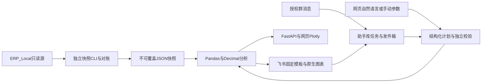

# 架构与实施规划

更新：2026-09-20。替代早期目标方案与已完成阶段执行清单。当前进度见[进度页](project-status.md)，测试证据见[验证记录](validation.md)。

## 目标与当前架构

当前提供ERP只读销售分析结果，服务平台内部运营。自然语言映射到有界分析计划，事实由本地程序计算。暂不做业务操作、任意SQL执行、自动经营决策或通用多Agent编排。



大模型通过Pydantic AI解释问题，只见当前问题、日期上下文和前次计划。业务记录与分析结果不进入模型；程序再核对原问题的日期、指标、条数及筛选条件。手动分析和固定飞书指令可不调用模型。

## 实际模块

| 位置 | 职责 |
|---|---|
| `backend/app/connectors/` | 参数化SQL只读取数、字段映射和控制总数 |
| `analysis/sales.py`、`workers/analyze_sales.py` | 主明细对账、快照指标与独立生成命令 |
| `analysis/analytics.py`、`planning.py`、`charts.py` | 六类确定性分析、共享计划校验、网页图形 |
| `schemas/analytics.py` | 日期、指标、步骤及结果契约 |
| `ai/analytics_agent.py`、`analytics_bounds.py`、`analytics_language.py` | 模型计划、独立条件检查、口语与默认规则 |
| `analysis/api.py`、`app/main.py` | 鉴权、目录、问答、手动分析和看板接口 |
| `integrations/feishu_analytics.py`、`feishu_sales.py` | 飞书问题、共享计算、持久化与原消息回复 |
| `integrations/feishu_jobs.py` | 独立助手SQL库、去重、租约、发件箱和追问 |
| `integrations/feishu_display_components.py`、`feishu_analytics_layouts.py`、`feishu_analytics_cards.py` | 同一integrations目录下的组件、六类模板、组合与容量降级；`feishu_analytics_text.py`保留文本回退 |
| `notifications/`、`workers/feishu_daily.py` | 日报预览、Webhook发送及独立可选调度 |
| `frontend/src/` | 看板、订单证据、口径、日报及AI分析页面 |

以上短路径均相对`backend/app/`，Worker相对`backend/`。历史三类销售解析与卡片代码保留用于兼容旧任务，不能因为文档合并直接删代码。

## 存储、口径和权限

- 源库：恢复后的SQL Server `ERP_Local`，仅授权对象只读取数。备份和安装介质在`database_backups/`，不属测试缓存。
- 快照：`.local/reports/`，保存范围、来源水位、对账状态、规则全文及指纹，生成后不覆盖。当前原始与经营两份快照均保留。
- 助手库：`ERP_AI_Assistant.erp_ai.feishu_sales_jobs`保存消息、任务、结果和发件箱；运行期不自动建库，初始化入口`scripts/init_assistant_db.py`。
- 业务口径：[指标定义](metrics-v1.md)、[数据字典](data-dictionary.md)、[业务假设](business-assumptions.md)分别维护，不再复制到各阶段计划。
- 网页使用绑定快照范围的本地令牌；飞书使用应用、租户、群和用户白名单。正式平台SSO和逐用户数据授权尚未接入。

每个分析计划1至6步，每步1至90个完整日，排行最多50项。比较期等长且不重叠；变化贡献保留“前N+其余”合计，波动规则不代表因果。真实分类或对象条件未接入时澄清，不能用金额替代销量。

## 执行与恢复

快照CLI承担源库读取。网页当前在请求线程池执行有界快照计算，没有持久网页分析队列。飞书事件回调只校验／入队，独立Worker解析、计算、先保存结果再发送；同一应用本地只运行一个连接进程。

助手任务使用消息／事件去重、租约及旧租约防覆盖；模型调用前保存中断标记，未知调用不重试；发送结果不确定记`unknown`，不能盲目重发。追问只继承同身份、同快照、30分钟内成功送达的结构化计划；清除请求按入队顺序形成屏障。

飞书卡片2.0使用原生分页表格、VChart和折叠说明，客户端需7.20及以上。每卡最多5表格、2图表、200元素，JSON预算28KB；先去可选图形，再明确节选行数。展示不改变完整结果，完整报告链接待鉴权部署就绪后接入。

## 后续建设条件

近期任务按[进度页](project-status.md)的P0／P1／P2顺序执行，不另维护第二套清单。

数据更新先确定增量水位、源主键、删除和历史修正语义；按受影响时间／企业重算并对账，不能只补新订单或把状态更新当新增成交。变更尚不一致时不发布完整快照。

生产运行需进程守护、备份、日志轮转、任务保留期及告警。网页长期分析确有需求时再复用持久队列；权限与结果缓存必须同时匹配范围、规则版本和数据水位。支付退款、利润、库存等能力先补事实映射和口径，再扩展模型工具。

继续使用Pandas，先限制SQL范围、精度和内存，记录真实分析耗时、峰值内存及并发。全局去重、均值和排序不可简单合并分块结果。只有压测超出容量目标时才评估独立分析库、预聚合或分布式引擎；早期讨论的CDC、Kafka、Doris等均未实施，不属于现有运行依赖。

## 重新生成快照

从`backend/`执行，只读源库并写新的本地快照：

```powershell
../.venv/Scripts/python.exe -m workers.analyze_sales --start 2026-09-01 --end 2026-09-17 --source-as-of 2026-09-16T14:33:41+08:00 --all-buyers
```

日期含起点、不含终点，取数CLI最多366天；分析工具的90天限制是另一层约束。必须明确全平台或指定企业范围。来源截至时间必须真实，不能把刷新运行时间当作数据水位。输出路径默认新文件，`--output`不能覆盖已有快照；改规则后重新生成，再让服务加载新路径。
