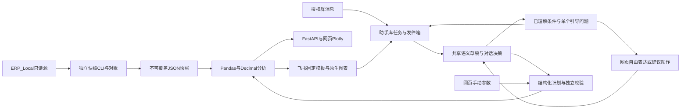
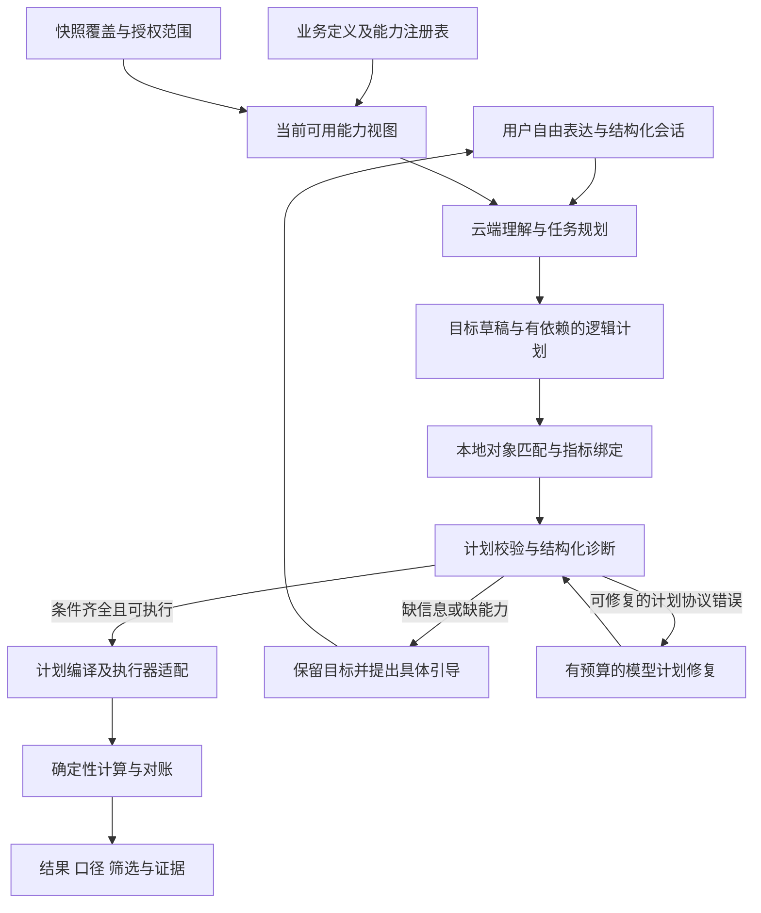
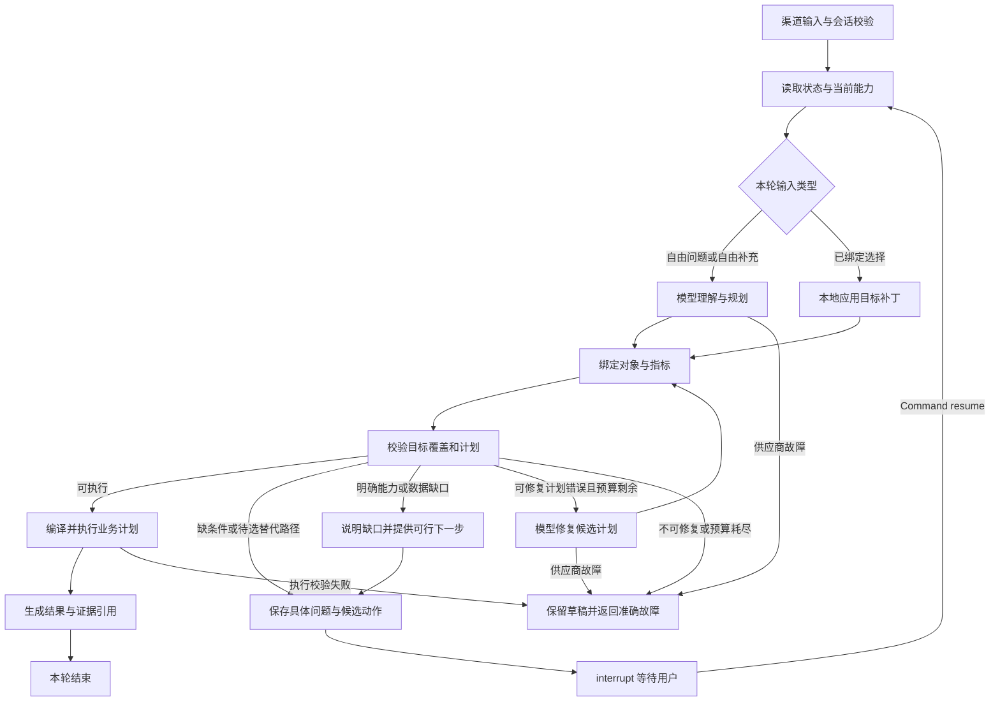

# 架构与实施规划

更新：2026-09-22。替代早期目标方案与已完成阶段执行清单。当前进度见[进度页](project-status.md)，测试证据见[验证记录](validation.md)。

## 目标与当前架构

当前提供ERP销售、退货、销售出库和库存的只读分析结果，服务平台内部运营。自然语言映射到有界分析计划，事实由本地程序计算。暂不做业务操作、任意SQL执行、自动经营决策或通用多Agent编排。



大模型通过独立语义接口解释问题，只见当前问题、消息日期、业务语义配置、结构化会话状态及服务端裁剪的能力和完整日期元信息。业务记录、名称目录、分析结果和身份不进入模型；程序合并条件、解析日期、检查能力，决定引导补充或转换为既有销售计划。手动分析、固定飞书指令和已绑定的建议动作可不调用模型。

## 实际模块

| 位置 | 职责 |
|---|---|
| `backend/app/connectors/` | 参数化SQL只读取数、字段映射和控制总数 |
| `analysis/sales.py`、`workers/analyze_sales.py` | 主明细对账、快照指标与独立生成命令 |
| `analysis/analytics.py`、`planning.py`、`charts.py` | 六类确定性分析、共享计划校验、网页图形 |
| `analysis/dialogue.py`、`semantic/dialogue_schemas.py` | 渐进引导、目标草稿、单个澄清问题、可验证的建议动作及渠道共享响应 |
| `schemas/analytics.py` | 日期、指标、步骤及结果契约 |
| `semantic/schemas.py`、`provider.py`、`prompt.py` | 独立语义契约、可替换云端适配器和结构化输出提示词 |
| `semantic/compiler.py`、`dates.py`、`context.py` | 结构化能力校验、会话补全、日期、销售计划转换和签名上下文 |
| `backend/config/semantic-catalog.json` | 四域术语、默认值、口径及当前执行能力，版本化维护 |
| `ai/analytics_agent.py`、`analytics_bounds.py`、`analytics_language.py` | 旧注入式计划器兼容、旧路径校验、共享口语说明 |
| `analysis/api.py`、`app/main.py` | 快照范围校验、目录、问答、手动分析和看板接口 |
| `integrations/feishu_analytics.py`、`feishu_sales.py` | 飞书问题、共享计算、持久化与原消息回复 |
| `integrations/feishu_jobs.py` | 独立助手SQL库、去重、租约、发件箱和追问 |
| `integrations/feishu_display_components.py`、`feishu_analytics_layouts.py`、`feishu_analytics_cards.py` | 同一integrations目录下的组件、六类模板、组合与容量降级；`feishu_analytics_text.py`保留文本回退 |
| `notifications/`、`workers/feishu_daily.py` | 日报预览、Webhook发送及独立可选调度 |
| `frontend/src/` | 看板、订单证据、口径、日报及AI分析页面 |

以上短路径均相对`backend/app/`，Worker相对`backend/`。历史三类销售解析与卡片代码保留用于兼容旧任务，不能因为文档合并直接删代码。

## 存储、口径和权限

- 源库：恢复后的SQL Server `ERP_Local`，仅授权对象只读取数。备份和安装介质在`database_backups/`，不属测试缓存。
- 快照：`.local/reports/`，保存范围、来源水位、对账状态、规则全文及指纹，生成后不覆盖。当前原始与经营两份快照均保留。
- 助手库：`ERP_AI_Assistant.erp_ai.feishu_sales_jobs`保存消息、任务、结果和发件箱；运行期不自动建库，初始化入口`scripts/init_assistant_db.py`。
- 业务口径：[指标定义](metrics-v1.md)、[数据字典](data-dictionary.md)、[业务假设](business-assumptions.md)分别维护，不再复制到各阶段计划。
- 网页为本机免登录入口，不校验本地访问令牌；追问状态仍由服务端签名并绑定快照范围。飞书使用应用、租户、群和用户白名单。正式平台SSO和逐用户数据授权尚未接入。

每个分析计划1至6步，每步1至90个完整日，排行最多50项。比较期等长且不重叠；变化贡献保留“前N+其余”合计，波动规则不代表因果。真实分类或对象条件未接入时澄清，不能用金额替代销量。

## 执行与恢复

快照CLI承担源库读取。网页当前在请求线程池执行有界快照计算，没有持久网页分析队列。飞书事件回调只校验／入队，独立Worker解析、计算、先保存结果再发送；同一应用本地只运行一个连接进程。

助手任务使用消息／事件去重、租约及旧租约防覆盖；模型调用前保存中断标记，未知调用不重试；发送结果不确定记`unknown`，不能盲目重发。追问只继承同身份、同快照、30分钟内成功送达的结构化计划或语义澄清状态；清除请求按入队顺序形成屏障。

## 独立云端语义层（2026-09-22）

默认入口使用`SemanticPlanner`。`SemanticProvider.interpret(SemanticInput) -> SemanticRequest`是供应商无关边界：输入包含问题、消息日期／时区、结构化上下文和裁剪后的能力／完整日期元信息；输出为业务目标、带ID的待解决事项或明确编辑动作，最终草稿保持1至6个目标，不包含SQL、代码或业务数字。默认`CloudSemanticProvider`使用Pydantic AI和OpenAI兼容协议，复用根目录已有`ERP_AI_BASE_URL`、`ERP_AI_MODEL`、`ERP_AI_API_KEY`。兼容协议供应商可直接换配置；其他协议只需实现该接口并注入`SemanticPlanner(provider=...)`，无需修改计算器。

这是一层独立模块和HTTP接口，部署在现有后端中；没有本地模型、微调、额外数据库表或新增模型依赖。通常一次模型调用，结构校验最多一次修复，总请求最多两次；网络失败不自动重试。模型暂不可用返回服务错误，不能归咎于用户问法。

云端适配器对官方百炼地址显式控制思考模式：已确认支持低强度的`deepseek-v4-flash-0731`、`deepseek-v4-pro-0813`、`deepseek-v4.1-flash`启用思考并传`reasoning_effort=low`，其他百炼型号沿用旧接口的直接输出设置。通用兼容供应商不会收到这些适配参数。默认高强度曾触发25秒超时；完全关闭思考虽更快，但实测损失组合意图准确性，因此当前型号保留低强度思考。HTTP等待仍为25秒，整次理解仍为30秒，没有增加网络重试。失败日志只记录固定原因类别及耗时，不记录异常正文、问题、密钥或模型响应；用户分别收到超时、鉴权失败、繁忙、连接失败或无效结果提示。参数依据见[百炼官方说明](https://help.aliyun.com/zh/model-studio/deepseek-api)。

四域为`sales`、`returns`、`shipping`、`inventory`，与执行能力分开。销售六类及新增退货、销售出库、库存执行器按快照已加载的事实启用；旧快照仍仅提供销售能力。组合问题有任何不支持条件时先保留整个草稿，不默默返回销售子集；只有可分离目标并经用户明确选择，才删除本次不执行的目标。依赖关系或未解决事项不能通过拆分绕过。退款、库存、销量与有效订单金额不能互换。

会话以`new/followup/answer`区分新问题、追问和澄清回复。目标、筛选条件和待解决事项有稳定ID；编辑按ID定位，支持设置／清空字段、添加／替换／删除筛选和显式删除目标。未提到的目标及条件继续保留，目标不明时先澄清，不以数组位置猜测。模型通过`resolved_issue_ids`标记已解决事项；旧字符串字段仅作兼容。相同业务域的操作变更保留筛选与请求范围。已确定相对日期转换为绝对区间，跨午夜补充指标不会改变原统计日期。

中文单日、数字日期、中文区间、今天／昨天／上周／最近N天由`dates.py`确定性解析。今天根据消息日期，不使用快照末日；数据覆盖检查位于计划转换之后。日期最多90天，比较期等长且不重叠，执行器继续执行原有对账与范围检查。

网页上下文通过`conversation_token`往返，绑定本地工作区、快照和语义配置版本并在30分钟后过期。签名密钥独立保存在`.local/semantic-context.key`，仅在服务端使用；删除或更换该文件使旧会话失效。当前网页为本机免登录入口，不校验访问令牌，也未实现逐用户SSO隔离。飞书复用助手任务表的`semantic_notice`载荷，只有成功送达的提示可成为下一轮上下文。

按用户要求，语义配置v2只定义业务事实、指标含义、默认口径和能力，不再包含客户问法别名；提示词不依靠具体问句示例。模型负责业务域、目标、指标、对象、范围、筛选和歧义识别。已移除原`grounding.py`的中文正则意图裁决，以及根据原话推导排行条数的规则，避免正确语义因未收录的表达而被拦截。

模型输出`scope`表示请求范围，程序将其与实际授权快照比较；它不能扩大权限。`generic_product_scope`触发已约定的药品泛称口径说明，不再靠原话词匹配。客户没有明确衡量方式时程序应用业务默认；已明确的数量、金额、订单数不能互换。程序只校验结构化语义、执行能力、日期、会话及授权，模型遗漏原文条件的风险必须通过云端评测和真实反馈持续观察，不能宣称已被确定性规则完全消除。问句样本仅用于评测，不注入运行提示词。

飞书卡片2.0使用原生分页表格、VChart和折叠说明，客户端需7.20及以上。每卡最多5表格、2图表、200元素，JSON预算28KB；先去可选图形，再明确节选行数。展示不改变完整结果，完整报告链接待鉴权部署就绪后接入。

## 已实现：自由对话与渐进引导

已接入网页和飞书：客户用自然语言表达需求，助手组织目标草稿、补齐必要条件并执行分析；客户无需掌握指标术语、固定句式或一次性提供完整参数。继续使用现有云端语义接口和销售执行器，没有新增部署服务。验证及运行状态集中维护在[验证记录](validation.md)和[进度页](project-status.md)。

### 交互方式

自由对话配动态条件卡片：输入始终开放，条件卡片展示已理解的目标、明确条件、继承条件和默认值；建议选项是省输入的捷径，不限制可接受的表达。网页自然语言入口使用`/converse`，正常引导不再统一显示红色错误；旧`/ask`的422语义仅为兼容旧客户端保留。

### 核心交互规则

1. 每轮先保留已理解内容，区别用户明确条件、继承条件与业务默认；对外用业务语言简短说明。
2. 条件足够就直接执行。未明确指标但已有约定默认口径时，应用默认并说明，不为填满所有字段反复追问。
3. 只对会改变结果且不能合理确定的疑点提问；每轮最多一个关键问题，通常提供2—3个建议回答，同时允许自由补充、改意和跳过可选项。
4. 客户表达很宽泛时，先帮助确定想了解的业务目标，不直接要求填指标名称或重写完整问题。模型提出歧义和候选解释，程序结合真实能力筛选可用动作；必要时由程序生成具体引导。
5. 正常补充不是错误。缺信息显示对话卡片；数据不足、能力不足显示原因与可选路径；网络、模型超时和系统异常才显示错误与重试入口。
6. 不支持的条件不能通过更多追问伪装成可执行。明确说明能力缺口；更换指标、缩小范围、删除筛选或只执行组合的一部分，都需客户明确选择，不能自动替换。
7. 同一疑点连续两轮未解决时，展示已知条件和具体候选解释，允许逐项修改或换目标；不重复同一句通用提示。客户仍可继续自由对话，没有硬性两轮截止。

### 对话决策与职责

流程：用户消息／选项动作 → 语义理解或已绑定动作 → 目标草稿与能力检查 → 引导或执行。结果后的主动探索建议尚未接入，客户可继续自由追问。

模型负责理解自由表达、识别指代与修正、提出具体疑点和候选解释。程序根据结构化条件、业务默认、真实能力、日期覆盖和权限决定是否可以执行。具体疑点可由同一次模型调用产生，程序校验其候选动作；不增加每轮第二次模型调用来润色提示，也不新增独立Agent服务。语言理解和供应商可用性仍需持续评测，不保证所有表达都一次理解正确。

如果程序淘汰了模型提出的不合适选项，可直接根据结构化原因生成具体提示，不为补充文案再调用模型；这类输出格式规范不限制客户的输入表达。

语义输入已增加经服务端裁剪的能力摘要和完整日期范围：可执行业务域、分析类型、金额／订单数指标、是否支持对象筛选，以及是否覆盖全平台授权的布尔边界。不传业务明细、结果、客户身份、凭据或名称目录。内部可选动作ID不交模型推断展示编号，动作只由应用层验证。模型不能通过声称支持某项业务绕过执行器，也不能自行改变显式数据日期。

对话决策至少区分：

| 情况 | 助手下一步 |
|---|---|
| 可按明确条件或已约定默认执行 | 直接分析，并说明实际口径 |
| 缺必要信息或有实质歧义 | 说明已理解内容，提出一个具体问题 |
| 业务能力缺失 | 解释已理解的需求和当前限制，给客户可选择的替代目标 |
| 日期不在完整数据覆盖内 | 展示实际日期覆盖；由客户选择修改日期，绝不自动把今天换成历史日期 |
| 组合包含不支持部分 | 保留全部目标，询问是否先执行明确可分离的部分；相互依赖的条件不能拆开假装满足 |
| 请求超出授权 | 保持权限边界，可引导使用已有授权范围，不能通过选项扩权 |
| 系统或模型故障 | 保留草稿，显示准确故障类型；用户可重试 |

### 会话与接口契约

`target`表达业务分析维度，允许非空、最多80字符的名称，常见维度使用配置中的标准ID，未收录维度仍可保留原名；它不是执行能力白名单。`filters`表达限制范围，两者分开。编译器在生成计划前拦截未支持维度，当前仅商品／客户可执行，底层分析类型及权限没有扩大。地区等能力缺口提供需明确选择的替代建议，不省略维度或默认改成商品。

共享响应和语义草稿使用带稳定ID的目标、约束及待解决事项：

```text
DialogueTurn
  status: result | needs_input | capability_gap | data_gap
  understood_summary
  draft: intents[id, fields, constraints[id], field_sources]
  clarification: id, intent_id, field, kind, question
  choices: id, label, action
  applied_defaults
  available_dates: start, end_exclusive
  repeated_clarification
  allow_free_text: true
  conversation_token
  result: 可选，复用现有分析结果
```

`field_sources`区分explicit、inherited、default；`clarification`只呈现当前最关键事项，其余保存在草稿中。选择动作是受校验的条件补丁，不拼接模板问题再重新识别。客户自由回答仍交模型理解，再转换为相同补丁协议。

按目标／条件ID设置、替换、添加和明确删除条件，按待解决事项ID解除歧义。没有提到的条件继续保留；删除须由用户明确表达并形成编辑动作，或选择服务端提供的允许动作。自由表达的明确修正可直接修改草稿，无需再要求点击确认同一句话。旧无ID会话和旧字符串字段保留兼容，不能将兼容逻辑作为新多目标编辑的依据。

追加分析通过`add_intents`表达，保留原目标，总数仍最多6个；只沿用唯一共同的已核验日期，范围／筛选存在差异时继续引导。目标暂未定位的修改保存在`pending_request`中，供下一轮模型结合用户选择重新提交，不直接执行；其中的日期必须先经原话核验。已知草稿的可见摘要保留未解除的关联限制及待定位修改，过期后恢复也不能静默遗失这些条件。

已新增`POST /api/v1/analysis/converse`，一次请求完成理解、对话决策及必要时执行；`result`、`needs_input`、`capability_gap`、`data_gap`均返回200。既有`/ask`、`/interpret`和`/run`保留兼容。请求发送`question`或`choice_id`之一及可选`conversation_token`；`date_range`动作另传`date_range.start`和不含终点的`date_range.end_exclusive`。完整示例见[接口说明](analysis-assistant.md#开发接口与验证)。

选项允许动作保存在签名上下文内，绑定对话轮次、目标、字段及可解除的事项ID；客户端只提交选项ID及该动作允许的日期参数。服务端验证后执行，不重新调用模型。沿用30分钟有效期及快照隔离；`/converse`遇失效上下文返回409 `context_expired`，失效动作返回409 `choice_expired`；参数错误422，模型服务故障503。本机网页无需访问令牌，飞书仍校验应用／租户／群／用户授权。客户端取消旧请求并防止旧响应覆盖新草稿。

### 网页与飞书呈现

网页在输入框附近显示已理解内容、当前问题、建议选项和自由回答区域。日期可用日期选择器，目标和指标可用建议按钮；点击已确定条件把修改提示放入输入框，供用户补充后提交。会话失效时保留页面当前草稿和未完成补充，用户点击「恢复这份草稿」才作为新问题重新理解；不静默套用失效令牌，也不保证刷新或关闭页面后的草稿持久化。结果复用原有表格与图形。

飞书共享同一对话决策，使用普通蓝色说明卡片与编号选项，客户可自由补充或修改。完整引导响应随任务持久化，仍只有成功送达的轮次可以继承；恢复已保存提示不重新调用模型。网页日期选择器动作在飞书隐藏，剩余建议重新编号。当前没有卡片点击回调或引用卡片编号定位，后续接入时再复用同一动作协议。

纯数字回复仅接受同身份30分钟窗口、清除屏障之后的唯一待答轮次，且最近语义任务已成功送达。中间出现新问题、多轮建议、未知送达或过期时，保留可用草稿并请客户用文字说明选择，不将旧编号套到新选项。

### 实施范围与持续评估

已实现引导闭环：结构化待补事项与单问句、统一对话响应、网页条件卡片、自由回答、飞书编号建议，区分正常引导与系统错误。

已实现条件显式修改／删除、按目标ID处理组合、能力缺口的可选路径、重复澄清提示与网页上下文过期恢复，并接入退货／销售出库／库存事实和执行器。后续建设包括结果后的探索建议、飞书卡片点击回调、资金退款与退货率、库存历史与周转；这些仍未接通。

验收关注客户能否继续完成任务：不同表达能否达到相同语义结果，短回答能否补齐条件，明确修正能否覆盖旧条件，不相关条件是否保留，不支持请求是否给出真实可行的下一步。覆盖跨域、组合、日期缺口、模型故障和送达失败；分别记录任务完成率、平均澄清轮数、重复提问率、无必要澄清率、约束遗漏率与响应时间，不以“模型返回了JSON”当作理解成功。

独立评测入口`evaluation/dialogue.py`复用现有`converse`，生产请求不依赖评测集。版本化JSON存放来源、固定提问日、每轮问题、离线参考语义和独立验收标签；回放模式验证程序链路，显式云端模式验证供应商输出。报告保留版本哈希、状态、错误类别和耗时，失败后跳过依赖轮次且不计为通过。当前完成场景通过率及引导／字段偏差统计，真实用户任务完成率和长期约束遗漏率仍需扩充标注流量，不能用种子集推算。

输出形态由模型区分整体汇总、对象列举、相对排行和是否发生；条件不全时也要保留已理解的形态。对象确有歧义可具体澄清，不能直接降级为概览。日期已明确但数据未覆盖时，语义层保留日期，程序负责数据缺口引导。评测可人工标注不同但合理的澄清路径，仍要求每条路径满足完整目标和约束，不以某一种表述作为客户问法限制。

复合筛选按每个明确条件分别表达，包含与排除分开；不能依据模型猜测的分类关系将条件视为冗余而省略。当前对象筛选仍未接入执行器，完整保留条件后说明能力缺口，不能为了可执行而删除条件。

## 通用任务规划架构重设计（分阶段实施）

2026-09-22，用户要求先重新设计更合理可靠的架构，再推进对象筛选，并明确选用LangGraph。现已完成主对话链路的LangGraph StateGraph迁移，保留供应商无关接口及确定性执行器。本节中的通用计算DAG、能力注册和对象绑定仍是后续设计；已实施边界见下方“LangGraph编排落地设计”。具体阶段和优先级统一维护在[项目进度](project-status.md#下一步顺序)。

### 当前问题与设计目标

目前不是按评测题库匹配用户问题：模型已能识别未见过的表达。但是理解后的`SemanticIntent`主要由固定的domain／operation／metric槽位组成，编译器直接把它们映射到少数分析模板。多个intent主要表示并列任务，没有可执行的前后依赖图。因此“销售排行”和“库存排行”可以分别查询，“库存较多且销售较少的同一批商品”却不能仅靠并列查询满足。

另一个限制是能力事实分散：语义JSON、`operations.py`常量、`planning.py`能力摘要、`compiler.py`以及`dialogue.py`各自维护部分边界。这会造成模型看到的能力、程序允许的计划和用户收到的引导不一致。排序限制曾需要同时修改多个位置，属于这一问题的实例。

下一版本以业务目标及其约束为中心，由模型选择和组合已注册的计算能力。新表达不需要新增问法规则；新计算能力仍需可信的数据与执行器实现。系统必须区分以下情况，不能都退回“请补充指标”：

| 情况 | 行为 |
|---|---|
| 表达新颖，已有能力足够 | 生成合法计划并执行，不因未见过这句话拒绝 |
| 目标明确，可由多步已有能力组合 | 建立有依赖关系的计划，验证关联键和口径后执行 |
| 缺少会改变结果的条件 | 保留已有目标，只问当前阻塞的一项 |
| 已明确条件，但数据、指标或算子缺失 | 指明具体缺口，保留目标，给出确实可执行的可选路径 |
| 模型调用失败或协议错误 | 按系统错误处理，保留草稿，不能解释为用户表达有误 |
| 已完整覆盖且没有匹配记录 | 返回可信空结果，区别于对象没匹配或日期没覆盖 |

### 职责划分



继续部署在现有FastAPI后端中，以LangGraph组织供应商可替换的规划节点和确定性节点。它负责状态流转、条件路由、澄清暂停和检查点恢复；语言理解仍由云端模型完成。官方说明LangGraph可以组合模型节点与普通程序节点，也可以不采用LangChain的模型封装，因此可先保留现有SemanticProvider适配器。[LangGraph官方概览](https://docs.langchain.com/oss/python/langgraph/overview)

| 模块 | 职责 | 不能承担的工作 |
|---|---|---|
| 业务定义与能力注册表 | 指标定义、事实粒度、单位、时间依据、合法关联与算子输入输出 | 不保存客户问法清单；业务定义不等于已具备执行能力 |
| 云端规划器 | 理解用户目标、指代和修改，给出目标草稿、候选逻辑计划及真实疑点 | 不输出SQL／Python，不编造商品编码、业务数据或能力 |
| 本地对象与指标绑定 | 在授权快照中解析名称／编码，将指标绑定到版本化定义 | 不把名称相似当成同一对象，不把数量换成金额 |
| 计划校验与编译 | 检查依赖、类型、粒度、单位、日期、权限和成本；生成确定性执行计划 | 不用问法关键词重新判定用户意图，不静默删除约束 |
| 对话决策 | 根据诊断和草稿选择一个关键问题，生成可验证的候选动作 | 不用通用报错掩盖明确能力缺口，不替用户接受替代方案 |
| 执行与展示 | 计算、证据、结果解释及失败定位 | 不由模型编造数值；模型故障时不切换成猜测结果 |

建议目录：新增`orchestration/`存放LangGraph图、状态、节点、会话恢复和检查点适配；`planning/`存放能力注册、逻辑计划契约、校验、诊断和执行器适配；`semantic/`保留语言理解与供应商适配；`analysis/`保留事实计算；`analysis/dialogue.py`渐进改为图的渠道响应适配器。实际实施应先落接口及兼容测试，再移动代码，避免一次性重写。

### LangGraph编排落地设计

**2026-09-22实施边界：主对话编排迁移已完成。** `backend/app/orchestration/graph.py`定义`load → understand → compile → validate → execute/ respond`，需要补充时由`respond → wait`暂停，恢复后回到`load`。节点重用独立的语义适配、编译、权限／日期校验、四域执行和引导构造组件，不以一个节点包住旧对话函数。下图中的对象绑定、通用计算DAG及额外模型计划修复仍是下一阶段设计；当前图不叠加模型重试。

`runtime.py`负责渠道／身份／快照／版本绑定、每轮45秒流程时限、最多20次图步骤和显式恢复；现有模型适配器仍限制最多2次HTTP调用、总计30秒。`store.py`以SQLite事务保留请求预约、版本和已完成响应，检查点另存独立SQLite文件，结果只通过引用进入图。流程检查点记录结构化语义及目标；提交成功的请求回执保存对外响应和对应上下文，恢复入口读取已提交回执，防止采用尚未提交的半轮状态。两份数据库不构成分布式事务：进程在提交回执前崩溃时，执行结果视为未确认，不自动重放模型请求；用户明确重试后从最后成功轮次重新校验。

网页／飞书分别存于`.local/langgraph/web`与`.local/langgraph/feishu`，可通过`ERP_GRAPH_STATE_DIR`覆盖。会话、回执、结果有效期30分钟；后续请求惰性清理过期结果，每次最多删除50个过期会话及其检查点，停服期间不后台清理。仅用于当前单机部署，未宣称支持生产集群。`ERP_ANALYSIS_ENGINE=legacy`可显式回退；图会话不会静默混用旧引擎，需确认恢复或新开对话。同语义版本的旧签名会话可导入图，保留目标及建议ID。

网页继续使用`DialogueTurn`协议，新增可选`request_id`。同ID同内容的已完成请求复用响应；同ID不同内容、旧轮次修改、并发请求返回409。网络结果不明时重用ID；明确模型失败后的用户重试使用新ID。超过60秒仍未确认的预约提示显式重试，不无限显示处理中。未携带ID的旧客户端仍兼容，但不具备客户端重试去重保证。飞书用持久任务ID作为请求ID，仅从已送达上下文继续，发送仍由原发件箱负责。`/analysis/interpret`保持纯语义接口，旧`/analysis/ask`保留兼容，手动`/analysis/run`不经过对话图。

调用图时显式关闭LangSmith追踪；当前问题、快照、模型实例通过Runtime注入，不进入检查点。结构化字段可能保留用户提供的条件值／澄清文字，但不保存完整聊天记录、原始模型响应、ERP明细或凭据。

明确区分两张图：**流程图**由开发者用StateGraph定义，规定理解、校验、澄清、恢复和执行如何衔接，可以存在有预算的修复循环；**业务逻辑计划图**由模型在注册能力内生成，描述数据计算依赖，必须无环。模型不能任意添加LangGraph节点、Python函数或运行边；组合分析通过受校验计划交给执行节点处理。[Graph API官方说明](https://docs.langchain.com/oss/python/langgraph/graph-api)

建议主图如下。自由文字一次模型调用同时产生目标草稿与候选计划，不机械地让每个节点都调用模型；已绑定选择动作走本地补丁路径。



LangGraph节点负责调用纯业务组件，不把旧`compiler.py`或`dialogue.py`全部塞进一个节点后就认为重构完成。应逐步拆出状态补丁、能力校验和诊断路由；`add_conditional_edges`等路由只消费结构化诊断，不匹配中文问法。节点输入输出使用明确类型，依赖通过运行时上下文注入。

**状态与数据边界。** `GraphState`至少包含目标草稿、候选计划、已验证计划引用、诊断、待回答问题／动作ID、结果引用、请求ID、轮次／状态版本、模型调用计数和快照／能力／口径版本。目标和条件按稳定ID更新，不能使用简单列表追加使已删除条件再次出现。运行时上下文提供模型适配器、授权检查、快照读取器及当前输入；每次构造模型输入都显式裁剪，不把整份GraphState发送给模型。

不采用自动累积全部聊天内容的MessagesState。当前用户原文及自由补充在本轮运行上下文中使用，检查点只保存结构化草稿和必要引用；恢复载荷使用已校验动作或不透明输入引用，避免将原文直接通过Command恢复载荷写进检查点。进程若在原文被解释前退出，客户端需明确重新提交该输入，不能宣称可以无损恢复尚未保存的原文。快照明细、完整候选目录、模型原始响应与密钥不进入检查点；本地结果另存受范围绑定的结果文件或已有助手任务载荷，GraphState只存引用。

**暂停与恢复。** 将澄清问题及动作准备放在独立节点中并保存，再由专用等待节点调用`interrupt()`；API返回现有引导响应，不保持HTTP请求一直等待。只有已有待答中断才使用`Command(resume=...)`，正常结束后的追问通过新一轮输入继续。恢复必须使用对应thread并重新检查动作所属轮次、范围、版本和30分钟有效期；过期仍返回409并保留可见草稿。官方明确恢复时会从中断节点开头重跑，因此等待节点中不能先调用模型、取数或发送飞书消息。[Interrupts官方说明](https://docs.langchain.com/oss/python/langgraph/interrupts)

**检查点选择。** 单元测试使用InMemorySaver；本机试用采用官方SQLite检查点适配器，网页与飞书进程使用独立文件和渠道命名空间，例如`.local/langgraph/web.sqlite3`、`.local/langgraph/feishu.sqlite3`，不声称跨渠道自动共享会话。单进程内同一thread串行执行，恢复请求以request_id及状态版本去重；本机试用保持每渠道单进程的部署边界。多人／多进程部署前评估共享持久检查点后端及跨进程互斥；不能把内存锁或SQLite试用验证视为已满足分布式一致性。[官方持久化说明](https://docs.langchain.com/oss/python/langgraph/persistence)

`thread_id`由服务端分配并绑定网页会话或飞书应用／租户／群／用户，随机ID本身不是授权凭据。浏览器继续使用签名会话句柄，不恢复本地登录令牌。会话运行状态迁移到服务端检查点及已提交回执，签名句柄只绑定thread、版本、快照和过期时间，避免客户端令牌和检查点各自保存一份不同的可执行状态。飞书已送达边界仍由助手任务表维护；准备好的图状态不等于提示已送达。数据库文件不提交Git，设置保留期、过期清理和备份；无需为此修改ERP_Local或将图检查点混入ERP业务表。

**重试及副作用。** LangGraph恢复机制不自动保证外部模型调用或消息发送恰好一次。模型调用预算须在调用前持久登记，已完成输出被检查点保存后可复用；调用结果未知时沿用当前中断语义，不由图无限重试。Pydantic AI结构修复与图计划修复共享每轮最多2次调用和总超时预算，不能叠加。已验证的只读计算可以按快照及计划哈希重新计算；结果落地以request_id幂等。飞书发送继续由现有发件箱完成，图不直接发送消息；已保存结果／待发件箱按引用对接，未知送达不盲目重发。

**部署与观测。** 采用开源LangGraph库嵌入现有后端；第一版保留SemanticProvider及其Pydantic AI适配，等价验证后再决定是否替换模型客户端。新增依赖及检查点适配器需在Python3.11环境解析兼容版本并锁定，实施时不笼统升级现有全部依赖。前端第一版仍消费原DialogueTurn；后续进度推送仅暴露阶段、耗时和公开诊断，不能直接转发完整图状态。默认不启用外部LangSmith追踪；官方支持的观测能力不等于项目获准上传提示或业务内容。

LangGraph迁移专项验收包括：澄清暂停后恢复、进程重启后从持久检查点恢复、同thread重复提交／并发冲突、旧动作与过期会话拒绝、快照及图版本变更、模型失败预算、图循环上限、检查点不含原文／密钥／明细，以及飞书重复执行不重复发送。当前通用规划的验收门槛继续适用；仅成功运行一张图不能当作自然语言理解已改善。

### 两层契约：目标草稿与执行计划

**目标草稿（GoalDraft）**保留客户到底要得到什么：稳定goal_id、简短目标描述、对象、指标意图、时间、范围、条件、目标间关系和待解决事项。明确值、业务默认值、继承值分别标记。不能因为无法映射现有操作枚举而丢掉目标描述；未知业务概念保留为未绑定项，不能为了通过结构校验强行改成已知指标。

**逻辑计划（LogicalPlan）**用有向无环图表达计算，每个节点包含稳定node_id、注册的operator_id、参数、inputs依赖和它满足的requirement_ids。输出类型、事实粒度与权限不能由模型自行声明为可信值，校验器须从注册表和输入节点推导。程序再将合法节点编译为现有`AnalysisStep`或后续确定性算子。

每个目标／约束应对应计划中的实现位置或一个未解决诊断，形成覆盖映射。该检查能阻止计划丢掉结构化草稿中的条件，但不能证明模型从原话中提取了全部意图；原话理解遗漏仍须靠独立评测、用户可见摘要和修正入口检验，不能宣称已被程序完全消除。

候选算子从有限集合渐进接入：读取授权事实、对象筛选、按维度聚合、排序与截取、等长期间比较、按合法键关联、对齐后差值／比值。它们描述计算能力而非客户句式。SQL和任意表达式都不成为开放算子；比值必须绑定经确认的业务定义、分子分母、时间及零分母处理。

模型不能选择尚未实现的算子执行。第一阶段把现有六类销售分析和新增三域基础分析注册为可执行节点；跨域关联等节点最初明确标为未实现，完成单独验证后才开放。

### 能力注册表与运行时能力

注册表是执行能力的唯一来源，至少定义：能力ID及版本、业务含义、输入参数和输出类型、分组粒度、指标及单位、时间依据、筛选支持、合法关联键、执行器适配器、数据前提、范围限制和成本上限。业务术语仍可独立配置，但不能再次手写一份执行白名单。

服务端将注册能力与当前快照覆盖、数据完整性和授权范围求交，生成模型可见的能力视图与本地校验规则。模型只看到经过裁剪的元信息；不接收记录、企业身份、完整对象目录或分析结果。API目录、模型提示和引导建议应从同一份能力生成，并通过契约测试核对。

对象名称由本地授权目录绑定：稳定编码精确匹配、唯一完整名称匹配可直接采用；简称、相似名称或同名多编码展示候选让用户选择。无匹配时说明“当前授权数据内未找到”，不能说全平台不存在，也不能直接计算为零。候选只在客户端展示；向模型传下一轮结构化状态时移除候选目录及服务端执行细节。选择动作绑定目标、条件、当前快照及会话轮次。

筛选计算约定：同一字段多个包含对象取并集，排除优先，跨字段同时满足；更复杂布尔关系须由明确的条件树表达，不能压平成一个字符串。商品条件作用于明细，客户条件作用于单据归属；商品筛选后的金额只包含匹配明细，单据数去重。统计、图表、证据和导出必须共享同一份已绑定条件，不能统计部分商品却展示整单金额作为同口径证据。

### 校验、诊断及引导

计划校验至少包括：

1. 结构合法、依赖存在、无环、算子已注册且可执行，禁止未知指令。
2. 客户已明确条件全部有实现位置；明确撤销必须来自用户修改或已绑定动作。
3. 指标、维度、粒度和单位兼容，跨单位不能相加，订单数不能从商品行简单求和。
4. 日期覆盖及完整性可证实；当前库存不能替换成历史余额，缺数据不能补零。
5. 关联键及关系基数已注册；关联前预聚合，关联后核对控制总量，防止金额放大。
6. 每一步权限范围不扩大；中间结果继承范围，关联不能取得未授权对象。
7. 计算有界。第一版保留最多6个业务目标、每期90个完整日、排行最多50项；初始计划节点上限拟为12，具体行数／内存上限经合成压测后配置。

校验返回结构化`PlanDiagnostic`，包含reason_code、goal_id、node_id／constraint_id、已知条件、缺失前提以及允许的下一步。建议分类为`missing_information`、`entity_ambiguous`、`entity_not_found`、`metric_undefined`、`data_unavailable`、`operator_unavailable`、`invalid_plan`、`permission_denied`、`budget_exceeded`。内部原因映射到现有result／needs_input／capability_gap／data_gap，模型服务故障继续单独返回系统错误，保持渠道接口兼容。

对话层按阻塞关系选问题：先解决影响目标或路径的歧义，再补能推进执行的关键条件；有已约定默认值的可选字段不反复询问。明确缺数据、缺指标定义或缺算子时，直接说明缺口，不再要求用户换句话重复同一需求。替代计划必须预先通过能力检查，并说明将改变的时间、指标或目标；需用户明确接受才采用。关联目标不能静默拆开作为独立结果。

例如“哪些商品上周卖得少，但库存还很多”：模型应保留销售与库存两个条件及同商品关联，识别“少／多”的衡量规则是否需要确认。目标计划为销售按商品聚合、库存按商品与单位聚合、合法键关联、应用阈值和排序。若销售周日期未覆盖，或库存只有备份时点，先如实说明；用户接受改看历史期间和备份后才能执行。若关联算子未开放，则说明关联能力缺口，不能拿两张独立榜单冒充交集。需要纳入零销售商品时，还须指定商品全集来源；只有销售日期完整覆盖、关联关系可靠时，未匹配记录才可按定义计零。

### 模型预算、会话与可观测性

通常一次模型调用同时生成理解草稿和候选计划。程序可直接绑定或补默认值时不再调用模型。只有可修复的计划协议错误才允许一次模型修复，发送固定诊断码和裁剪能力信息，不发送结果或对象目录；结构修复和计划修复共享总调用预算，第一版每轮合计最多2次，不能层层重试。沿用总超时上限，真实缺数据／权限／业务定义不进入模型修复循环。

会话保存目标草稿、明确条件、待解决诊断和计划版本；普通追问只应用目标补丁，改动影响的依赖节点重新校验。快照、能力或口径版本变化时使旧可执行计划和建议失效，保留可见草稿，由用户明确恢复后重新绑定。飞书继续遵守已送达上下文、去重和未知送达不盲目重发等现有规则。

记录请求ID、耗时分段、供应商故障类别、诊断码、计划节点类型及版本哈希；不默认保存问题全文、原始模型输出、身份、目录或业务明细。区分模型理解偏差、计划错误、能力缺口、数据缺口和执行异常，否则无法判断是要改提示词、补执行器还是更新数据。

### 迁移与可靠性验收

采用增量迁移：先完成LangGraph依赖兼容验证、最小StateGraph及检查点／中断恢复验证，再统一能力来源、接入GoalDraft／LogicalPlan及结构化诊断；通过适配器复用现有执行器，已有简单查询行为与数值先保持一致；之后才启用对象筛选、销售数量和经过注册的跨域关联。新旧通道通过配置切换，新会话先灰度启用图路径；旧会话继续原路径或由用户明确恢复为新草稿，不能在请求中途偷偷切换引擎。回退也只作用于新轮次，已产生副作用的请求不得改走另一引擎重复执行。正常请求不同时调用两个模型做影子对照；使用合成、经审核的离线／云端评测比较结果。

验收样例用于测试，不导入线上提示词或问题路由。开发集与冻结验收集分开，覆盖未见表达、同义改写、错别字、省略、反向条件、跨业务关系、长链追问及未知任务。约100场景作为首个扩充目标，不代表足以推断真实流量准确率。

拟定首轮门槛：已有离线回归全部通过；确定性权限、条件保留、单位／精度及对账测试不得出现失败；冻结验收集中“已有数据和能力足够”的任务完成率目标至少95%，另列真实缺口的正确引导率。模型服务失败必须计入端到端完成率，同时另报剔除供应商故障后的语义指标，不能将超时或依赖跳过算作通过。P50／P95、平均澄清轮数、不必要澄清率、约束遗漏率和同题多次一致性按固定批次报告；不得仅挑选重试成功的结果。以上是拟定验收目标，不是当前已达到的指标。

## 后续建设条件

近期任务按[进度页](project-status.md)的P0／P1／P2顺序执行，不另维护第二套清单。

数据更新先确定增量水位、源主键、删除和历史修正语义；按受影响时间／企业重算并对账，不能只补新订单或把状态更新当新增成交。变更尚不一致时不发布完整快照。

生产运行需进程守护、备份、日志轮转、任务保留期及告警。网页长期分析确有需求时再复用持久队列；权限与结果缓存必须同时匹配范围、规则版本和数据水位。支付退款、利润、库存等能力先补事实映射和口径，再扩展模型工具。

继续使用Pandas，先限制SQL范围、精度和内存，记录真实分析耗时、峰值内存及并发。全局去重、均值和排序不可简单合并分块结果。只有压测超出容量目标时才评估独立分析库、预聚合或分布式引擎；早期讨论的CDC、Kafka、Doris等均未实施，不属于现有运行依赖。

## 重新生成快照

从`backend/`执行，只读源库并写新的本地快照：

```powershell
uv run python -m workers.analyze_sales --start 2026-09-01 --end 2026-09-17 --source-as-of 2026-09-16T14:33:41+08:00 --all-buyers
```

日期含起点、不含终点，取数CLI最多366天；分析工具的90天限制是另一层约束。必须明确全平台或指定企业范围。来源截至时间必须真实，不能把刷新运行时间当作数据水位。输出路径默认新文件，`--output`不能覆盖已有快照；改规则后重新生成，再让服务加载新路径。
## 四域执行接入（2026-09-22）

沿用独立语义接口、签名会话和只读快照，在 `SalesReport` 增加可选业务事实包；旧销售快照仍可读取，缺少业务事实时明确提示重新取数，不把未加载的数据视为零。模型不接收事实明细。

- 退货：`XSTHDH/XSTHDB`，以退货单创建日期统计已完成退货单，按原销售单校验客户关系；展示金额、单据数、按单位分开的数量。不是资金退款，不计算未经定义的退货率。
- 出库：`CKFHQRH/CKFHQRB` 已确认的销售出库（`CKLX=售出`），采用确认日期 `SHRQ`，关联原销售单。采购退出单分开，不混入销售出库。已只读核验销售出库确认日期与原订单发货出库日期同日、主明细金额及数量一致。
- 库存：`SPPHGLBH.KCSL` 商品批次余额，按 `SPBM` 关联商品档案取得名称、单位；库存时点为备份截至时间。只支持全平台已授权范围，不能用采购企业权限推导仓库库存权限；不伪造仓库归属、历史日结库存或周转率。
- 执行：扩展受约束计划的业务域，按域分派；退货、销售出库支持概览、趋势、商品／客户排行、明细和有无记录，库存支持单时点概览、商品排行、明细和有无库存。组合请求全部校验后执行；数量分单位统计、分单位排行并明确展示截取边界。
- 会话：沿用自由输入和稳定目标 ID；缺日期、指标歧义继续引导，能力由已加载事实决定。库存查询明确展示备份时点，今天不能自动改成历史余额；用户可明确选择现有快照。
- 展示：网页和飞书共用业务结果，标明业务域、日期依据、计量单位与来源。新业务证据与销售订单 ID 分开，避免点击到同号销售单。

实施顺序：① 合成测试和事实／计划契约；② 固定只读连接器及对账；③ 分域计算、语义转换和会话引导；④ 网页／飞书展示；⑤ 全套回归、生成新快照、重启和本地接口验收。重点验证跨单位求和、重复关联、越权、空数据与缺数据、库存日期、组合问题和错误证据链接。继续使用现有架构，不新增模型部署、业务写入或调度基础设施。
